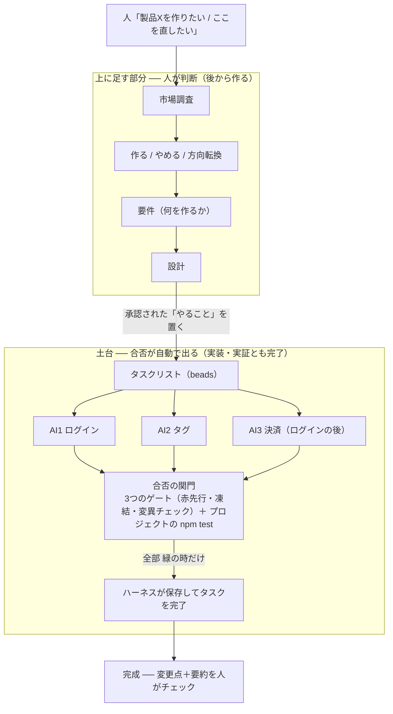

# DESIGN — 複数の製品を同時に「AIまかせ」で開発する仕組みの設計

この文書は、この仕組みの「何を作りたいか」と「どう作るか」をまとめたもの（設計の SoT）

**位置づけ**：設計 → 部品ごとの実証 → 1本に統合 → 本物のリポジトリで実走、まで済んだ状態を書いてある
「なぜそう決めたか」と「実測で分かった制約」も残してある（消すと同じ議論と同じ穴を繰り返す）

読む順番は上から
「作りたい物」→「**どう動くか（§2 の通しフロー＝ここが本体）**」→「工程と関門」→「守ること」→「作り方」→「実際にできるか」→「**決めたこと／やらないこと**」
細かい調べ物（他社ツール・公式情報）は末尾の付録に寄せた

**この文書は「確定版」だけを書く**
どう辿り着いたか（過程）は書かない——過程は決定が変わるたびに腐り、**古い決定として読めてしまう**から
過程が要るなら git 履歴と [proof/README](proof/)（実証の記録）を見る
**ただし「なぜそう決めたか（理由）」と「実測で分かった制約」は過程ではないので必ず残す**（消すと同じ議論と同じ穴を繰り返す）

---

## 1. 作りたいもの（一言で）

**1台のパソコンで、複数の製品を、AIに指示するだけで同時に開発させる**
人がやるのは「何を・どうなったら完成かを指示する」ことと「出来上がりを確認する」こと
コードを書く・テストする・直す・保存（コミット）は AI が自分で繰り返す

### 完成形イメージ（何を目指すか）

**前半（何を作るか）は人が判断・承認、後半（コードを書く・テスト）は AI が同時並行で勝手に進める**



各AIは**別々の作業コピー**で動く（互いのファイルを踏まない）、既存の製品なら承認を挟まず会話で直接タスクを置く、1タスクの中身は下の [§2 の通しフロー](#2-どう動くか)

※ 関門の中身（3つのゲート）と1タスクの一生は **§2 の通しフロー**

二段構え:
- **土台＝図の「土台」の枠（コードを書く＋テスト）**：ゲートが合否を判定するので、AIが自分で進められる
  **これ単体でも役立つ**（会社の既存の製品にそのまま使える、要件は人が用意済みなので指示を出すだけ）＝ **実装・実証とも完了**（§6）
- **上に足す部分＝図の「上に足す部分」の枠（調査→決定→要件→設計→…→自己改善）**：人が判断するので一旦止まる
  新しい製品をゼロから作る全体像、**後から足す**

→ 土台は独立した部品なので、いつでも「一部だけ」使える（§3）

## 2. どう動くか

以降、テストが全部通る状態を**緑**、1つでも落ちる状態を**赤**と呼ぶ

まず言葉の意味（ここがブレると全部ブレる）:
- **指示** … 人がAIに渡す、ざっくりした頼み、例「製品Xにログイン機能をつけて」
- **タスクリスト** … やることを置いておく共有の台帳、ここに「やること」が1枚ずつ乗る（中身は後述の beads というツール）
- **ワーカー（AIの作業1本）** … タスクリストから1枚取って、それを仕上げる独立したAIの作業
- **完成** … その1枚が「終わった」と**人が見なくても確かめられた**状態（例：その機能をチェックするテストが全部通る）

### 通しフロー（1タスクの一生）— ここが本体

**入口：人が会話で言う**「ログイン作って、その後 決済、あとタグ」
→ AIがタスクリストに1枚ずつ置く（`bd create`、**人はファイルを手で書かない**）、依存も張る（決済はログインの後）

**そこから先は、ハーネス（親）が各ワーカーについてこれを回す:**

0. **ワーカーを起動** ── 別々の worktree で隔離／本数・予算・緊急停止の範囲内（§4-8）

1. **タスクリストから1枚 claim** ── ワーカーごとに別の名前（`BEADS_ACTOR`）が必須（§4-5）
   - 取れる仕事が無い時（依存待ち／全部 claim 済み）は、すぐ終わらず少し待って再挑戦する（依存が解けて ready になるかもしれない）
   - 終了条件: タスクリストに「終わってない仕事」が1つも無くなったら、ワーカーは自分で終わる
   - 待機にも上限（永久に待たない＝終了保証）

2. **ワーカーが「テストだけ」書く**（実装は書かせない）

3. **ゲート1｜赤先行** ── ハーネスが「実装が無い状態」でテストを走らせる
   - 緑になった → REJECT（実装が無いのに通る＝何も検証していない）

4. **ゲート2｜凍結** ── テストのハッシュを記録する

5. **ワーカーが実装する**（「書く→テスト→直す」を自分で繰り返す＝内側の繰り返し）
   - 緑になったら「終わった」と申告（close も commit もハーネスの仕事・勝手にやっても取り消される）

6. **凍結の検証** ── `tests/` の**どのファイル**でも1文字変わっていたら REJECT（弱めて通すズル）
   - 今回 書いたテストだけでなく、既存のテストも対象（別ファイルを弱める抜け道を塞ぐ）

7. **チェック一式（＝プロジェクトの `npm test`）をハーネスが自分で走らせる**
   - ハーネスが呼ぶのは `npm test` だけ、型やビルドも見たいなら test スクリプトに組み込む
   - 赤 → ワーカーに差し戻し（下の再試行の階層で打ち切る）

8. **ゲート3｜変異チェック** ── 実装をわざと壊して、テストが気づくか
   - 生き残った変異が1個でもある → REJECT（テストが実装を縛っていない）
   - **REJECT の前に自己チェック** ── その生き残りを1個ずつ 手で当て直し、素の `npm test` を回す
     - 赤 → テストは殺せている＝ツールが壊れている → ゲートを使わず人に差し戻し
     - 緑 → 本物の生き残り → REJECT を確定させる
   - 生き残りを次のワーカーに渡して **2 からやり直す**（変異チェックが出した事実を伝える）
   - 再試行は2階層 ── 同じ会話で3回（`MAX_ATTEMPTS`）→ それでも駄目なら記憶を捨ててまっさらに投げ直す（`MAX_ROUNDS`・既定2）→ 人に差し戻し
     - 差し戻しは非決定的に起こるため（同じタスクが合格↔差し戻しに割れる・§4）
   - ループは止めない（他のワーカーは次へ）

9. **ここで初めて保存** ── ハーネスが `git commit` ＋ `bd close`
   - ワーカーが自分でコミットしていたら、ハーネスが呼び出しの直後に取り消している（commit を許すとゲートを1つも通らずに保存できてしまう・§4「やってはいけないこと」）
   - 見張り中モードは commit 前に人が変更点を確認／放置モードは自動 ── 見張り中モードは未実装

10. **終わった枝を1本ずつ main に統合＋毎回 全テストを再実行**
    - 緑なら採用／赤なら巻き戻して main を緑のまま保つ

**10 の後は 1 に戻る**（次の1枚へ）── これが外側の繰り返し、0 は最初の1回だけ

**この流れの読み方（3つだけ）:**
- **ワーカーは「手」、ハーネスが唯一の「門番」**
  実際にチェックを走らせて緑を見た者（ハーネス）だけが完了・保存できる、**ワーカーに commit / close の役割を渡さない**＝AIの「できました」宣言では1行も保存されない<br>※ **権限で止まっているのではない** ── ワーカーは worktree の中で `git commit` も `bd close` も叩けてしまう、ハーネスが呼び出しの前後で検出して**取り消す／開け直す**ことで成り立たせている（proof の落とし穴25・29）
- **テストの良し悪しも、人ではなくゲートが判定する**（ゲート1・2・3＝§4）、**人の承認をループの中に入れない**——入れると人がループに戻り、**無人の放置と両立しなくなる**
- **並列が効くのは「独立したタスクが複数ある」時だけ**
  依存が直列に連なっていると、**ワーカーを増やしても1本しか動かない**（後続は待機するだけ）＝ **人が"独立した仕事"を配ることが、並列の前提**

**本体は「タスクリスト」ではなく「繰り返し（ループ）」の方**
タスクリスト（beads）は「何を・どの順番で・誰が取ったか」を覚えておくだけの台帳
価値の中心は、各ワーカーが回す**「取る→書く→テスト→直す→緑→完了→次」の繰り返し**と、**「実際にテストを走らせて緑でしか完了にしない」厳しい関門**
タスクリストはそれを支える1部品にすぎない

**配り方は「両方」できる（信頼度で使い分け）:**
- **見張り中（最初）＝人が指名**：人が「このAIにログイン」と特定のワーカーに直接振る、タスクリストは裏で「順番・取り合い防止・記憶」を担う
- **放置（信頼が貯まったら）＝AIが取りに行く**：人はタスクリストに積むだけ、各ワーカーが空いてる1枚を自分で取って回す
- どちらもタスクリストが土台、だから地続きで移行できる（**信頼ランプ**＝人がAIを信じるにつれ 見張り中→半自動→放置 と自律度を上げること＝§4「完成の定義」）
- 正直に言うと：**見張り中は beads の「取りに行く（ready・claim のプール）」はほぼ使わず、裏方（依存順・claim排他・記憶・被り検知）として働く、プールが本領を出すのは放置モード** 同じタスクリストの上で使う機能が段々増えていく、という地続き

**タスクリストは「1つ」・コードは「バラバラ」（並列の要）:**
- **タスクリストは共有**（`.beads/` はメインリポジトリに1つ、worktree をまたいで同じタスクリストを見る）、だから **claim 排他・依存の順・被り検知が、別々に動くワーカーの間で効く**
- **コードは worktree で隔離**（git の `worktree` ＝同じプロジェクトの作業コピーを複数持つ機能）、互いのファイルを踏まない
- **複数製品＝この仕組み一式をコピーするだけ**（タスクリストは製品ごとに1つ・リポジトリごとに `bd init`）、**製品をまたぐ「親玉」は作らない**（＝今の前提「1台のPC・製品が数個」では不要、前提が変わったら見直す＝§7-2③）

**人が手でやってた繰り返しを、ハーネスに肩代わりさせる（ここが肝）:**
今あなたがAIを使うとき、手でこうしている → それをハーネスに渡す:

| 今 人が手でやってる | 肩代わり |
|---|---|
| 何を作るか指示する | **人のまま**（会話で、AIがコマンド化してタスクリストに置く） |
| やることの順番・取り合いの管理 | **タスクリスト（beads）**（依存の順・早い者勝ちの確保） |
| 何を「完成」とするか（合否テスト） | **AIがテストを先に書く → その質を3つのゲートが判定**（赤先行＋凍結＋変異チェック・§4）、人の承認は重要な所だけ |
| 出力を読んで「終わった？正しい？」と判断 | **`npm test` が判定（実際にテストを走らせて緑か）** ← ここが本体 |
| ダメなら「続けて」と言い直す | **ハーネスが不合格の中身を渡して呼び直す**（`MAX_ATTEMPTS`・`MAX_ROUNDS`） |
| 完成・保存 | ハーネスがテスト通過で自動保存、人は後でチェック |
| 互いに邪魔しないように | 別々の作業コピー（worktree） |

→ 人は **「何をやるか決める人」のまま**、**「1回1回言い直す係」だけ引退**する
（これが Claude Code 開発者 Boris Cherny の言う「自分の仕事は"繰り返しの仕組み"を書くこと」、言い直す係を仕組みに置き換え、役割が「言い直す人」から「言い直す仕組みを作る人」に変わる）
なお この §2 は、下の工程でいう「コードを書く工程」の中身、全工程の中での位置は §3

## 3. 工程の流れと「工程ごとの関門」

新しい製品をゼロから作る場合は、工程が連なる
**各工程には「次に進んでいい？」を判定する関門があり、その種類が工程ごとに違う**

- **自動で合否が出る関門**：テストが通った/通らない のように**コマンドが exit code で答えを返せる** → **人がいなくても通れる（AIが自分で進める）**
- **人しか判定できない関門**：良し悪しを人しか決められない → **止まって人を待つ（AIだけでは進めない）**

| 工程 | 関門 | AIだけで進める？ |
|---|---|---|
| 市場調査 | 人（良い調査か？） | 不可 ── 止まって人が見る |
| **作る/やめる/方向転換の決定** | **人・最重要**（手がかりが無い製品判断） | 不可 ── **人が必須**（AIに「この製品をやめる」を自動で決めさせない） |
| 要件（何を作るか） | 人（この要件でいいか？） | 不可 ── 承認待ち |
| 設計 | 人（この設計でいいか？） | 不可 ── 承認待ち |
| **コードを書く** | **`npm test`（通った？）** | 可 ── 自分で進める |
| **テスト** | **`npm test`（全部通った？）** | 可 ── 自分で進める |
| （自己改善＝AIが自分のやり方を直す） | 手がかり少・最高リスク（悪く直すと全部おかしくなる） | 条件つき ── 専用の関門＋人チェック・後回し |

**鉄則：「正しく作る（コード・テスト）」はゲートで自動、「正しい物を・作るべきか（調査・決定・設計）」は人の関門、混ぜない**
ゲートが合否を出せるのはコード・テストの工程だけ
手前の工程には合否を出すコマンドが存在しない

**並列実行の仕組みは全工程で共通・違うのは関門だけ:** タスクリスト（beads）＋並列ワーカー＋「繰り返し」という仕組みは、実装だけでなく上の工程（市場調査・ネタ探し・要件・設計）にもそのまま使える
調査やネタ出しも「タスクリストに積んで並列で回す」ことはできる
**違うのは関門（合否を誰が出すか）だけ**——実装/テストは `npm test`（緑で自動）、調査・ネタ・要件・設計は人（良し悪しは人が判断して止まる）
だからAIは調査を「生産」はできるが、「採用（作る/やめる）」は人が決める（§6）

**自己改善は2段に分ける（記憶＝安全な第一歩）:**
上の表の「自己改善」は最高リスクだが、中身は2段に分かれる:
- **レベル1＝記憶ヒント（やる・安全）**：ワーカーが"やって分かった学び"を覚え、次のタスクで再利用、ループが回るたび賢くなる
- **レベル2＝AIが自分のやり方（ルール・ハーネス）を書き換え（後回し・最高リスク）**：悪く改造すると全部おかしくなる（表の「最高リスク」はこっち）

→ 記憶（レベル1）の**具体設計**（`bd remember`／`prime`／`forget`／`prune` の使い方）と「**記憶 vs CLAUDE.md**（混同しない）」の表は、**付録2「記憶（`bd remember`）の設計」**にまとめた（beads のコマンドなので beads の付録に置いた）

**一部だけ使える（重要な設計の考え方）:**
各工程を**独立した部品（関門つき）**として作れば、**状況に応じて一部だけ使える**

- **全工程**（調査→…→テスト）＝ 新しい製品をゼロから、人の関門が多い
- **コード＋テストだけ**＝ 既存の製品（要件は人が用意済み）、会社の製品にそのまま使える ← **これが土台・今すぐ役立つ・実証済み**

## 4. 絶対に守ること

「必ずこうであるべき」という条件、作るものはこれを満たす

**まず「ちゃんとした指示」の線引き:**
- **対象**：AIが自分で進められるのは「**コマンドで合否が出る作業**」（＝**ゲートを置ける工程**＝コード・テスト）だけ
  テストで確かめられない指示（調査・設計・方向転換の判断）は人の関門側で、人が完成を判断する
- **指示の大きさ**：指示は「**AI1本で終わる大きさ**」にする
  大きすぎると終わらず、途中で止まって失敗になる → 事前に人が小さく分ける

**守ること（コード・テストの工程について）:**
1. **「完成」はコマンドが判定する（既存ツールを走らせて）** そのプロジェクトが決めた「チェック一式」が全部パスすること
   - **必須**：**3つのゲートを通ったテスト**が `npm test` で通ること ── **ハーネスが走らせるのは `npm test` だけ**
   - ビルド・型チェック・lint・セキュリティ検査を合否に含めたいなら、**プロジェクトが `npm test` の中に組み込む**（例 `"test": "tsc --noEmit && vitest run"`）
   - 判定は既存ツール（OSS）の出力＝客観、AIは「ツールを通す」役（AIの意見で決めない）
   - **完了（`bd close`）と保存（commit）は、ワーカーではなくハーネス（親）が、自分でチェック一式を走らせて緑を確認した後だけ実行**（ワーカーに close/commit をさせない＝AIの「終わった」宣言では完了にしない ── ただし**権限では止まらない**ので、ハーネスが呼び出しの前後で取り消す・開け直す＝下の「やってはいけないこと」）、手順は §2 の通しフロー
   - **ベース（main）は常に緑に保つ**、**未着手タスクの受け入れテストを main に先置きしてはいけない**——並列だと**各ワーカーの worktree に「他タスクの赤いテスト」が入り、全員のゲートが道連れで永久に赤になる**（実機で発生した）
     **各タスクの受け入れテストは、そのタスクのワーカーが自分の worktree で書く**（＝要件2）、1ワーカーなら起きないが、**並列にした瞬間に破綻する**
2. **完成の条件は「テスト」で表す、テストは実装より先に書き、その質は3つのゲートが判定する**（3つの中身は下の節／手順は §2 の通しフロー）
   **人の承認は「ゲートを通った上で、重要な所だけ」の二次の層**（毎回ではない＝放置と両立する）
3. **完成の証拠＝その「3つのゲートを通ったテスト」が通ること**（2と一対）今まであるテストが通る（＝壊してない）だけでは未完成
4. **AIの「できました」を鵜呑みにしない** 完成の条件を満たしていなければ未完成
5. **AIの作業は共有のタスクリストで調整する** 複数のワーカーが同じタスクリストを見て、早い者勝ちで1枚を確保（claim）する → 同じ仕事を2人が同時にやらない
   - **前提：ワーカーごとに別の名前を与えること**（beads に「誰として操作するか」を伝える値・`BEADS_ACTOR=w1 / w2 …`）
     **同じ名前だと claim が"冪等"になり、2本とも成功して排他が効かない**（実機で確認した）、**別の名前なら、他人が claim 済みのタスクは `exit 1` で弾かれる**（＝ここで初めて排他になる）
   - **着手前に必ずタスクリストを見て、同じ/近いやることが既に進行中なら止まる**
     自由文の「近い被り」は自動では見抜けないことがあるので、疑わしきは安全側に倒す
     ただし**モードで振る舞いを変える**：見張り中（人が居る）＝即 人に確認（AskUserQuestion）／放置（人が居ない）＝**人の対応待ちで固めない**・疑わしい被りは「後で人が見るキューに退避（人に差し戻し）」か「スキップして次の ready へ」
6. **各AIは別々の作業コピーで動く**（worktree）、互いのファイルを踏まない
7. **暴走したら止まって人に返す**、失敗が続く・時間や回数の上限で
   **止まった作業の始末と、人にどう気づかせるか（状態ボード＋通知）は §7⑥**
8. **1台の能力の範囲で動く（安全は2段）**
   AIの使用量（トークン）の予算・パソコンの性能・APIのレート制限を超えない（**同時に動かすAIが N 本＝使用量も約 N 倍**）
   - **① 親プログラム側**（自前の設定ファイル・例 `.claude/` に置く）：同時セッション数の上限／合計予算／緊急停止スイッチ ← 本数の暴走（100本立つ）を止める
   - **② Claude Code 組み込み**（1セッションごと）：予算上限・ターン上限 ← 1本の暴走を止める
     ※正確な設定名は作る時に公式で裏取り
   - **親（ハーネス）がワーカーを起動する時点で①は最初から効かせる**（人が本数を決めるうちは緩めでよいが休眠ではない）
     **自動で仕事を見つける放置モードでは①が生命線**（無いと暴走）、最初は 2〜3本、設定で変更可
9. **成果は人がチェックできる形で出す** 完成ごとに「変更点＋なぜ動くかの要約」を付け、人が読んで理解・却下できるように（作った物を読まないと、後で誰も分からなくなる）
   チェックのタイミングは、下の「完成の定義」の段階で変わる（見張り中は保存前／放置中は保存後）

**一番の難所：「完成＝テスト通過」だが、そのテストは誰が書く？**
AIがコードもテストも自分で書くと、ゆるいテストを書いて自分で通せる（＝**自分の答案を自分で採点**）、放っておくと「完成」が嘘になる

**答え：テストの質も3つのゲートで判定する（人やAIの判断に委ねない）**
これは**要件1 の原則「完成はコマンドが判定する、AIの意見で決めない」を、コードだけでなくテストにも適用しただけ**
**人の承認をループの中に入れてはいけない**——入れると人がループに戻るので、**無人の並列放置と両立しなくなる**（「安全のため人の承認を挟もう」は、この理由で却下）

**決めたやり方＝2フェーズ（テストだけ書く → 実装）＋ 3つのゲート**
**手順そのものは [§2 の通しフロー](#2-どう動くか)（＝SoT、ここには再掲しない）**
**ここに書くのは「なぜ3つとも要るか」（外そうとした時に読む所）:**

| ゲート | 何をする | **これが無いとどうなるか（＝外してはいけない理由）** |
|---|---|---|
| **1. 赤先行** | 実装が無い状態でテストを走らせる、**緑になったら REJECT** | **何も検証していないテスト**（`expect(true).toBe(true)`）が通る |
| **2. 凍結** | テストのハッシュを記録し、実装後に変わっていたら REJECT | 実装フェーズで**テストを弱めて通せる**ので、**ゲート1 が無意味になる**（1と2はセットで初めて効く） |
| **3. 変異チェック** | 実装をわざと壊し、テストが気づかなければ REJECT | **「1ケースだけのゆるいテスト」「型だけ見るテスト」**（例 `expect(typeof f(5)).toBe('number')`）**が通る**——実装が無ければ赤になるので**ゲート1 をすり抜ける**、**実装のハードコード**も同様 |

**人とチェック役AIは「二次の層」（ゲートの代わりではない）:**
- **人の承認**：ゲートを通った上で、**重要な所だけ**（毎回ではない）、大事な所は**人がテストを直接書いてもいい**（一番硬い）
- **チェック役AI**：ゲートの**補助**（弱いテストを事前に減らす）、判断がソフトなので**ゲートの代わりにはしない**

**ゲート3（変異チェック）の道具:**
**変異ルールは自作しない**（自作すると**空白区切りの演算子しか壊せず、`*=`・`++`・数値リテラルを見逃す**＝ゲートが浅くなる）、**実在の変異テストツールを使う**（＝「車輪の再発明を避ける」§5）:

※ 例外は**既製ツールをハーネスから呼べない時** ── ハーネスの差し替え口（`MUTATOR`）は「`.mjs` の関数を1つ `export default` する」形しか受け取らないので、(a) そもそも既製ツールが無い成果物（markdown の記事）と (b) 既製ツールはあるが `.mjs` から呼ぶアダプタを書いていない言語（Python は mutmut があるが未検証・[mutate-py.mjs](sample/python-pytest/mutate-py.mjs) を自作した）が当たる
　いずれも**網羅性は自分で書いた分だけ**なので「生き残り0」の意味は弱い、条件は下の「コード以外の成果物」

| 言語 | 変異テストツール |
|---|---|
| **JS/TS** | **Stryker**（`@stryker-mutator/core`、**Vitest ランナーあり**＝`@stryker-mutator/vitest-runner`） |
| Java | **PIT**（pitest.org） |
| Python | **mutmut** / cosmic-ray |
| Rust | **cargo-mutants** |
| PHP / Ruby / Kotlin | Infection / mutant / mutant-kraken |

**ゲート条件＝「生き残った変異が 0 個」、変異スコアの閾値ではない（実測でそう決めた）:**

| 実装 | テスト | 変異スコア | 生き残り | 「スコア>=80%」のゲート | 「生き残り0」のゲート |
|---|---|---|---|---|---|
| factorial（ループ） | 本物 | 100% | 0 | 合格 | 合格 |
| factorial（ループ） | ゆるい | 28.57% | 5 | REJECT | REJECT |
| **gcd（whileループ）** | **ゆるい** | **80.00%** | **1** | **すり抜けた** | **REJECT** |
| gcd（再帰） | 本物 | 100% | 0 | 合格 | 合格 |
| gcd（再帰） | ゆるい | 60.00% | 2 | REJECT | REJECT |

- **変異スコアは「実装の形」で 60〜80% と揺れる**——`while (b)` を `while (false)` に壊すと**無限ループ → タイムアウト**になり、**変異テストはタイムアウトを「検出した(killed)」と数える** ＝ **何も検証していないテストが、実装がループを持っているというだけで点をもらう**
  実際に**ゆるいテストがスコア80%でゲートを通過してコミットされた**（実機）
- **「生き残った変異」は揺れない**——**「テストが検出できない壊し方が在る」＝まさに知りたいこと**そのものだから
  **だからスコアではなく生き残りを見る**
- **判定はハーネスが持つ**（ツール側の閾値機能には任せない＝唯一の門番・§4-1）
- **コストに注意**：変異テストは**テストスイートを何度も回す**ので遅い、**毎タスク全部**ではなく、**変更箇所だけ**に絞る

**通らなかった時（＝等価変異の逃げ道、これが無いと無限ループになる）:**
1. **生き残った変異を、次のワーカーへのフィードバックとして渡す**——「`if (a===0||b===0) return 0;` を `if (false)` に書き換えてもテストが全部緑のままだった＝ここを検証しているテストが1つもない」、**これはツールが出した事実であって、AIの意見ではない**
2. **打ち切って人に差し戻し**、無限リトライはしない
   打ち切りは2階層 ── **同じ会話で3回（`MAX_ATTEMPTS`）→ 記憶を捨てて まっさらに投げ直す（`MAX_ROUNDS`・既定2）→ 人に差し戻し**、既定では最大 3回×2ラウンド
   **2階層にしたのは差し戻しが非決定的だから** ── 同じタスクを同じ設定で回すと合格と差し戻しに割れる（実測は下）、フィードバックを引きずったまま3回で切ると通るはずのタスクを人に返してしまう
   **ループは止まらない**（他のワーカーは次のタスクへ）＝**放置と両立する**
3. **AIに「これは等価変異だから無視していい」と判断させない**（＝自分の答案を自分で採点に逆戻り、「殺せない＝等価です」と言えばどんな弱いテストも通せる）、**無視の印（`// Stryker disable`）は人間だけが付けてよい**（§7-2①）── ただし**印を付ける権限は無い、ワーカーは実装を書くので物理的に書けてしまう**（実測: 印を1行足すだけで生き残り2が0になり合格した）<br>→ **ハーネスがその走で増えた印を検出して不合格にする**（`addedIgnoreMarks`・元から人が書いていた印は尊重する）
4. **不合格の理由だけでなく中身を残す**（実測で分かった・下）——落ちたテストの出力・生き残った変異・**巻き戻す前のコードとテスト**をファイルに残す
   作業領域は書き直しのたびに元へ戻すので、残さないと**人が後から原因を調べられない**

**理由の1行だけでは、人は差し戻しを処理できない（実測で分かった）:**
差し戻しの理由は「実装後もテストが赤」のような1行しか残っていなかった
実際に踏んだ事故：**Windows でドライブレターが小文字（`c:\...`）だと Vitest がテストを1つも収集できず、人が用意した緑のベースまで落ちる**（大文字なら通る・cwd の表記だけが差）
ハーネスから見ると「実装後もテストが赤」にしか見えず、**AIの出力は正しいのに6回連続で不合格→人に差し戻し**、原因不明のまま2走ぶんの費用が消えた
→ **環境の差だけでループは全滅する**、そして**理由の1行では、それが AI の失敗なのか環境の失敗なのか人が区別できない**
→ 対策は2つ、**パスを絶対パスに正規化する**（原因側）と、**不合格の中身を残す**（診断側）

**等価変異が出たら、まず「実装が冗長」を疑う（実測で分かった）:**
```js
if (a === 0 || b === 0) return 0;    // ← 要らない（下の式が、片方が0なら勝手に0を返す）
return (a * b) / gcd(a, b);
```
このガードは**冗長**なので、`||` を `&&` に壊しても**全パターンで結果が同じ**＝**誰にも殺せない変異**になる
**冗長なコードが等価変異を生む**
実際に人に差し戻し、人が見たところ、**問題はテストではなく実装だった**——ガードを消したら**変異6個が全部 検出されて 合格**した
→ **人への差し戻しは「面倒な例外処理」ではなく、実装の設計ミスを見つける出口**

**コード以外の成果物（実証済み・記事のループで確かめた）:**
仕組みは移せる、**移せないのは「ゲートが何を保証するか」の方**

- **外枠も3つのゲートも、そのまま動く** ── 成果物の置き場所（`WORK_ROOT`）と 変異チェックの実行方法（`MUTATOR`）を差し替えるだけで、判定の仕組みには手を入れずに markdown の記事が通った
  **用途を広げる時はハーネスを複製せず拡張点を足す**（複製は本体の修正に追従せず必ず腐る）、拡張点は**実走で必要と分かったものだけ**足す
- **だがゲートが保証する中身は成果物で変わる** ── コードのテストは**振る舞い**を検証する（コードにとって「正しい」＝振る舞いが正しい）、記事のテストは**形式**しか検証できない
  実証: 合格した記事の事実を嘘に書き換えても、その記事を検証するテストは全部 緑のまま通った
- **生き残り0 を要求すると、成果物は検証された要素だけに痩せる** ── 変異チェックは「テストが検証していない部分」を全部 生き残りとして報告するので、通そうとすると「検証された要素以外を書かない」形に収束する
  コードでは望ましい規律（上の「冗長な実装が等価変異を生む」と同じ）だが、読み物では骨だけになる（`## 注意点` の下に注意点が1文も無い記事が合格した）
- **下限を数える検証は変異を殺せない** ── 「見出しが4つ以上」に対して記事に5つあると、1つ消しても条件を満たしたまま＝**個数ではなく要素の存在で検証する**（実測: 23個中20個生存 → 存在の検証に変えて7個）

→ **「テストを書けるもの」の範囲は、テストが何を検証できるかで決まる**、形式しか検証できない成果物では ゲートは形式しか保証しない

**変異ゲートには「自己チェック」が要る（実コードで回して分かった・一番大事）:**
当時 手元にあった Express API（135行・26テスト・このリポジトリには入っていない）に Stryker を素で当てたら、**変異138個・スコア 7.25%・メインの routes.js は killed 0（116個 全部 生き残り）** と出た
**「生き残り0」ゲートなら 全タスク即 REJECT → 永久に人に差し戻し** に見えた
**だが断定せず検証したら、逆だった**：生き残ったと報告された変異（`validateTitle` の条件を `true` に固定）を**手で入れたら、テストが4本 赤くなった** ＝ **テストは強い、ツールが この実コードで変異を効かせられていなかっただけ**
- **原因**：テストが **supertest で HTTP 経由**に叩き、**ソース（routes.js）を直接 import していない**＋ routes.js が **CommonJS** → 変異テストツールが「変異したファイルに関連するテスト」を辿れず、**「関連テスト0件」→ 全部 survived と報告**した（Stryker 自身がこのエラーを出した）
  ESM で直接 import している index.js は正常に killed が出た
- **怖いのは"黙って壊れる"こと**：エラーで止まらず、**それっぽい低スコア**を出す、信じると**完璧なテストでも全部 REJECT ＝ 人への差し戻しの嵐**になる
- **→ ゲートを信じる前に、ゲート自身を検算する（自己チェック・実証済み）**：**Stryker が「生き残った」と報告した変異を1個ずつ 手で当てて、素の `npm test`（Stryker ではない）を回す**
  - **npm test が赤** → テストは殺せている → **Stryker が嘘＝ツールが壊れて出した偽の生き残り** → **ゲート3 を使わず人に差し戻し**（人が Stryker 設定を直す＝テストが直接 import する等）
  - **npm test が緑** → テストが本当に殺せない → 本物の生き残り（弱い or 等価）→ 通常の REJECT
  - **壊れは「ファイル単位」**（実測：同じリポジトリでも **index.js＝ESM は正常／routes.js＝CJS は壊れ**）、だから**変更した src ファイルごとに検算**（実装 [proof/selfcheck.mjs](proof/selfcheck.mjs)）
  - **実証**：routes.js の生き残り8個は**全部 ツールの壊れによる偽の報告**（手で当てると npm test が赤＝テストは殺せている）と検出、index.js の生き残り6個は**全部 本物の生き残り**（手で当てても npm test が緑＝テストが殺せていない）と正しく判定
    **＝常に警告するのではなく、壊れている時だけ警告する**
- ＝ **生の変異スコアを鵜呑みにしない、実コードで正しく動かすのは、おもちゃの100倍むずい**（モジュール形式・テストの書き方・ツールの癖が全部 効く）、**変更箇所だけに絞る運用（速度対策）も、この設定調整の一部**

**補強：AIに「チェックを弱める」のを禁止**（テストと同じ抜け道を塞ぐ）—— 既存テストを消す/skip する・lint や型のルール設定を弱める・黙らせるコメント（`eslint-disable`・`@ts-ignore`・`# noqa`）を勝手に足す、いずれも禁止
これら「弱める系」は人の承認が要る

**完成の定義（段階を踏む・いきなり全放置しない）:**
1. **見張り中**：保存する前に、毎回 人が変更点を確認
2. **半分自動**：テスト通過は自動で保存、判断が要る所だけ人の対応待ち
3. **放置**：並べて席を離れ、戻って結果を確認
最終条件：複数の指示を並べて放置 → 各々「機能をチェックするテストが通って完成・保存済み（変更点＋要約つき）」か「理由付きで人に差し戻し」のどちらか／テストが通らない（壊れた）コードは1つも保存されていない

## 5. 自分で作る所 vs 既存の物に乗る所

**まず全体の組み立て（どれが本体で、どれが部品か）:**

| 部品 | 役割 | 出どころ |
|---|---|---|
| **繰り返し（ループ）＋厳しい関門** | **本体**：取る→書く→テスト→直す→緑→完了 を回し、実際にテストを走らせて緑でしか完了・保存しない | **自分で作る**（ここだけ他に無い） |
| タスクリスト（やること管理・記憶） | 何を・順番・早い者勝ち・記憶を覚えておく台帳 | **beads**（既存） |
| 複数を並列で回す親 | N本のワーカーを立てる・予算・本数上限・停止 | **自分で作る（素の Node で `claude -p` を並列 spawn）**、**Agent SDK は予算/セッション制御が要るようになったら**（付録0・§7④） |
| 各AIの作業コピー | 互いのファイルを踏まない隔離 | **worktree**（git・既存） |
| **コードの地図**（探す・影響範囲） | どこに何が／何が何を呼ぶ／どのテストが覆うか＋意味検索 → **ワーカーが読む量を減らす＝トークン削減** | **better-code-review-graph**（MCP・既存）、**採否と条件は付録0／詳細は付録5** |
| 不合格からの書き直し | 落ちた理由を渡して呼び直す（緑になるまで人が言い直さない） | **自分で作る**（ハーネスの `MAX_ATTEMPTS`・`MAX_ROUNDS`） |
| 完成チェック（ビルド/テスト/型/lint/セキュリティ） | 合否を出す | **プロジェクトの既存ツール（OSS）を走らせる** |

※ **調べた OSS の採否一覧（何を使う／使わない・何に・どこで）は 付録0**（＝採否の SoT、ここには再掲しない）

**本体＝表の一番上（ループ＋関門）＝ハーネスが回す1サイクル、その中身は [§2 の通しフロー](#2-どう動くか)（＝SoT・ここには再掲しない）**
ハーネス（親のプログラム）は **素の Node**、**beads・worktree・変異テストツールは、そのサイクルの各ステップが使う部品にすぎない**

- **自分で作る（ここだけ他に無い＝守る）**
  - 「完成＝ゲートの判定」の**厳しい関門**（実際にテストを走らせて、その結果で合否を出す）、**タスクリストの「完了」もこの関門に緑が出た後だけ付ける**
  - **暴走を止める安全装置**（ガードレール・本数/予算の上限・緊急停止）
- **既存の物に乗る** … 上の表のとおり、**何を使う／使わない・なぜ・どこで は 付録0**（採否の SoT）
- **道具を足す判断**：**「足して増える手間 ＜ 消える痛み」なら足す、道具は多いほど良いわけではない**
  選定は**スター数や煽り数字ではなく「うちの必要への適合」で**（例：beads＝"依存つきのタスクリストが要る"／コードの地図＝"トークンが最大の制約"）

**`/goal` の位置づけ（混同しない）:** **使っていない** ── 書き直しの繰り返しはハーネスが持ち、実装の中の試行錯誤は `claude -p` のセッションが自分でやる、`/goal` の判定は会話を読むだけなので最終ゲートにも使わない（§7-2①・付録1）

## 6. 実際にできるか（正直に）

**「人が完全に手を離して＝寝ている間にAIが勝手にバグ修正」は、できるけどボタン一発ではない**
- 既にある部品：定期実行（Claude のクラウド定期実行など）・画面なしでAI実行・権限のロック・使用量の上限
- 無い/自作が要る部品：出来事で起動（バグ報告が来たら即動く）・詰まったら人に回す・完成の検証
  GitHub Actions や外部連携（MCP＝AIを外部システムにつなぐ仕組み）で自分でつなぐ必要がある
- 失敗も多く、**使用量の暴走や「間違った物を保存してしまう」リスク**がある
  Boris Cherny のやつは Anthropic 社内の環境や試験機能が前提
  （※ 世に出ている「成功率◯割」の類の数字は**裏取りしていない**ので書かない、**判断材料は自分の実リポジトリで測った結果だけ**——付録5 と同じ原則）
- → **土台（実装＋テストの並列・人が入口を握る）は、オーバーナイト全自動の難所を避けている＝現実的**
  **並列実行の仕組み・ゲートを部品ごとに実機で実証し、さらに1本に統合して通した**（下の表・注／`claude` を実際に呼んで並列2本・コストも実測）
  **残るは本物/大きめのタスクでの実行**（今まではおもちゃタスク）
  放置・自動発見に進むほど、親の制御・予算上限・人への引き上げといった難所は戻ってくる（上に足す部分・後で）

**「やることを自動で見つける（人が手を離す）」のは、手がかりがある仕事だけ:**
- 自動で見つけられる：テストの失敗・バグ報告・レビューの指摘（＝読める手がかりがある）
- 自動で見つけられない：**「何を作るか」＝製品の判断・手がかりゼロ＝人がやるしかない**（手放すな）
- → 成熟した形は「反応する仕事（バグ・テスト失敗）は自動で見つける／生み出す仕事（何を作る）は入口で人が直接」の合わせ技、今は後者中心で正しい

**作る順番:**
1. **土台（コード＋テスト・同時並行・別作業コピー・厳しい関門）を単体で完成させる**＝会社の製品で今日使える・実証
2. その上に工程（要件・設計の連結）を「追加部品」として足す
3. 全自動の発見・人への引き渡し・自己改善は「上に足す部分・自作が要る」、焦らない

**どこまで実機で動いたか（机上ではない・でも全部できたわけでもない）:**
**実証コード・各段階が何をどう証明したか・再現手順・実装の落とし穴は [proof/README](proof/)（＝実証の SoT、ここには再掲しない）**

| §4 の要件 | 状態 |
|---|---|
| 1. 完成は `npm test` が判定（ハーネスが実テストで緑を見た時だけ保存） | **実証済み**（**これが核**、AIの自己申告では1行も保存されなかった） |
| 1. ベース（main）は常に緑 | **実証済み** |
| 4. AIの「できました」を鵜呑みにしない | **実証済み**（嘘つきワーカーを弾いた） |
| 5. claim 排他（ワーカーごとに別の名前が必須） | **実証済み**（実レースで弾いた） |
| 6. worktree 隔離 | **実証済み**（互いのファイルを持たない） |
| 依存＋外側ループ（依存が解けるまで出ない／タスクリストが空で自分で終了） | **実証済み** |
| 7. 暴走したら止める（失敗3回・時間上限） | **実装済み** |
| ⑤ 統合（1本ずつ統合＋全テスト再実行） | **実証済み** |
| **2/3. 難所｜ゲート1 赤先行 ＋ ゲート2 凍結** | **実証済み**（手抜きテスト `expect(true).toBe(true)` をゲートが弾いた）、**人の承認はもう毎回要らない**＝放置と両立 |
| **2/3. 難所｜ゲート3 変異チェック（Stryker）** | **実証済み**（実在ツールで本採用）、**赤先行をすり抜けたゆるいテスト**も、**本物のワーカーが書いた「`npm test` 緑・行カバレッジ100%なのに `lcm(0,0)` を検証していないテスト」も弾いた**、**ゲート＝生き残った変異0個**（スコア閾値では すり抜けた・§4） |
| **変異チェックのフィードバック・リトライ・人への差し戻し** | **実証済み**、生き残った変異を次のワーカーに渡して書き直させ、**3回×2ラウンドで人に差し戻し**、**実際に等価変異で差し戻しになり、人が見たら「実装が冗長」と判明 → 実装を直したら合格**（§4） |
| **変異ゲートを"実コード"で回す（おもちゃではない）** | **一度 回して重大な学びを得た**、当時の Express API に当てたら**スコア 7.25%・routes.js killed 0**、だが**テストは強い**（手で変異を入れたら4本 赤）——**ツールが CJS＋HTTP統合テストで変異を効かせられず"黙って最悪スコア"を出していた** |
| **変異ゲートの自己チェック** | **実証済み**（[proof/selfcheck.mjs](proof/selfcheck.mjs)）、Stryker の生き残りを素の npm test と突き合わせ、**ファイル単位で** ツールの壊れによる偽の報告か 本物の生き残りかを判定、**実コードで routes.js＝壊れを検出／index.js＝本物と判定 の両方向 正しく動いた**、**統合版（`integrated.mjs`）に selfcheck を変異ゲートの前段として配線済み・実証済み**（生き残りを**本物と判定したので、ツール壊れとして人に差し戻すことなく書き直しの指示へ進んだ**） |

**この表の「実証済み」は部品ごとの実証、さらに 並列実行の仕組み＋ゲートを1本に統合し、実機で通した（[harness/integrated.mjs](harness/integrated.mjs)）＝"通し"が閉じた:**
- **通し統合＝実証済み**——並列実行の仕組み（claim・worktree・並列・依存・外側ループ・⑤merge）と ゲート（赤先行・凍結・変異チェック・自己チェック・書き直しの指示・差し戻し）を1本に
  **肝＝ゲート一式を `spawnSync`→async に移植して並列骨格へ載せる**（spawnSync はイベントループを止めて並列不可）
  - **`claude` を実際に呼んだ走**：1本（gcd・survived 0・**$0.62**）／**並列2本**（gcd/isPrime・**claim排他が並列で効いた**＝w2 が弾かれ別タスクへ・**$1.16**）
  - **reject→フィードバック→回復／3回→人に差し戻し／2枝を main へ merge**：**stub ワーカー**で決定論的に実証（selfcheck 発火・誤った差し戻しなし・無限ループなし・main 全緑）
- **変異チェック × 並列 worktree**（先に AI 抜きで実測・統合版でも確認）：worktree は node_modules を共有しない（**各約96MB**）／**CPU 取り合い在り**（並列は速いが2倍にはならない・実時間の実測で −24%）／**レポート衝突は起きない**（各 worktree が自分の `reports/mutation.json`）
- **コスト＝実測済み**（もう「未計測」ではない）：`claude -p` は毎回 文脈を約27kトークン読み込む**固定費 ≈ $0.27/回**
  **書き直しゼロなら呼び出し2回で約$0.6/タスク**（おもちゃ）、出力は安い＝**リトライ/差し戻しが高い**（3回で約$1.2〜1.6）
  **並列はコストを下げない**（呼んだ分 払う・縮むのは時間だけ）
  **本物寄り（`validateUser`・変異52〜58）は $1.2〜1.4/件**（3回フル・おもちゃの約2倍）
- **本物寄りタスクでも実際に実行済み**（`validateUser`・変異52〜58）：ゲートは本物でも正しく機能（弱いテストは人に差し戻し・良ければ merge）、**だが実コードで2つ判明**——
  (1) **差し戻しは非決定的**（同じタスクを同設定で2回回したら **6→1→1＝差し戻し** と **2→8→0＝3回目合格** に割れた、claude が毎回 違うテスト/実装を書くため、**5回上限でも3回目で通った＝原因は回数不足でなく非決定性**）→ **その救済＝差し戻す前の自動やり直し機構を実装・stub実証済み**（`MAX_ROUNDS`：まっさら再挑戦→打ち切りで人に差し戻し）、**ただし効果（差し戻し率が本当に下がるか）と "内側フィードバックが効くのか（2→8 のノイズ疑い）" は実ワークロード待ち**
  (2) 生き残りは「**型ガードの穴**（本物）」と「**エラー文言の StringLiteral**（`"…" → ""`＝厳密一致の強制＝過剰仕様）」に二分 → StringLiteral の扱いは (b) で判断＝**"やらない"**（過剰仕様・等価・本物の穴が混在し 一律除外は本物シグナルを殺す・下の (b) 行）
- **本物のリポジトリでの検証（実施済み・実マシンの Windows・yaml）**：公開 OSS を clone して検証、**判明した実データ**——
  (1) **本物リポジトリは実マシンで base 緑になりにくい**（OS依存＝日付/プロセスは落ちる：tempo 35 fail・tinyexec 7 fail＋ビルドが OS のポリシーでブロックされた／純粋ロジックの yaml は 3386 緑）、ハーネスは「base 常に緑」前提なので **OS に依存して緑にならないリポジトリは回せない**
  (2) **ハーネスは「新しい独立したモジュールを足す」前提だが実 issue は全部"既存改変"**＝**変異を"変更した行だけ"に絞る適応が必須**（ファイル全体を変異させると yaml の log.ts でも survived 9）→ `integrated-real.mjs`（変更行だけを変異させる・既存コード修正用のプロンプト・単発）を作成
  **(3) 課金した走（yaml #706 eol）＝難所ゲートは実保守でも正しく機能した**（claude が実際の機能を実装・全3386緑・変更行の8個だけを変異させてファイル全体の問題を回避）**が人に差し戻し**（3回とも survived 1＝デフォルト値 `eol:'\n'` の StringLiteral・**冗長なデフォルト値が生む等価変異くさい**）
  **代償＝人への差し戻しの頻発（StringLiteral/等価変異が実コードで多い）＋高コスト($6.74/件・30分)**、**凍結の穴も判明→修正済み**（凍結の対象を `tests/` 全体へ＝実装段階で他の既存テストを弱めるズルを検出できるようにした・[harness/integrated.mjs](harness/integrated.mjs) の `frozen`）
  ＝**動くが、実運用は コスト最適化が要る、StringLiteral 除外は"やらない"**（過剰仕様・等価変異・本物の穴が混在＝一律除外は本物シグナルを殺す・人に差し戻して人が判断するのが正しい）
  **これ以上（製品として配れる形にする・実運用のコスト最適化）へ進むのは大きな投資、この playbook は実証の記録として完成させるのが筋** 詳細＝[proof/README.md](proof/README.md)
- **残る正直な未検証**：selfcheck の **Stryker壊れ→人に差し戻し は統合版では未走**（単体は実証済み）／統合の衝突を AI に解決させること（今は中止して人の対応待ち）
  未確定/未実装の残り一覧（**差し戻す前の自動やり直しの効果測定**／StringLiteral 除外／被り検知／差し戻し通知／設定／変更要約／記憶 …）は [§7-2②](#-将来今はやらない後でやる)（SoT）
  **＝プロトタイプの主張は証明しきり、残りは実ワークロード/製品化待ち＝一区切り**

## 7. 決定事項（守り方・作り方）— すべて決定済み

**守り方（合否テスト・完成の中身・停止・タスク管理・配り方・被り・本数）:**
- [x] **合否のテストを誰が用意するか**（難所）→ **AIが実装より先にテストだけ書く → その質を3つのゲートが判定する**（3つのゲート＝赤先行／凍結／変異チェック・§4）、**人の承認をループの中に入れない**（入れると放置と両立しない）
  **変異ルールは自作せず、実在のツール**（JS/TS＝**Stryker**）を使い、**ゲート条件は「生き残った変異が0個」**（スコア閾値では実測ですり抜けた）
  **ツールを信じる前に自己チェック**（ツールが「生き残った」と報告した変異を手で当て直し、素の `npm test` が赤ならツールが壊れている）、**通らなければ 3回×2ラウンドで人に差し戻し**
- [x] **「完成」の中身** → プロジェクトの `npm test` が全部パス、必須＝**3つのゲートを通ったテスト**、ビルド・型・lint・セキュリティを合否に含めたいならプロジェクトが `npm test` に組み込む（**ハーネスが走らせるのは `npm test` だけ**・§4 要件1）
- [x] **止め方の基準** → **3回×2ラウンド**まで粘ってから人に返す（差し戻しが非決定的なため・§4）
  - 実装した時間の上限は**呼び出し単位**（`claude` 1回=10分・`npm test`=2分・変異チェック=15分・`npm install`=5分）、**1タスク全体の時間で打ち切る仕組みは入れていない**（回数で打ち切れば足りた）
  - 「同じエラーの繰り返しで止める」も**入れていない**、回数の上限で足りたので判定を増やさなかった
- [x] **タスク管理の道具** → **beads を採用**（依存つきのタスクリスト・早い者勝ち・記憶、会話 → `bd create`・§5・付録2）、ただし本体はループ＋関門で、beads はタスクリストの1部品
- [x] **配り方** → **両方**（見張り中は人が指名／放置に進むと各AIがタスクリストから取りに行く・§2・信頼ランプ §4）
- [x] **被り防止** → 共有のタスクリスト＋早い者勝ちの確保、**着手前にタスクリストを見て、被りは止めて人に確認**（§4 要件5）
- [x] **同時に回す本数** → 起動時の引数で指定（実装は既定1本・上限4本）、放置モードでは親が 2〜3本を上限に強制（§4 要件8）

**作り方（親・統合・後始末・記憶・上に足す部分）:**
- [x] **④ AIを回す親プログラム** → **素の Node（`claude -p` を並列 spawn）**、**Agent SDK は使わない・APIキーも要らない**（Claude Code のサブスク認証で動く）
  - **Agent SDK は「必要になったら」入れる**：予算の集中管理・セッション制御・N本のきめ細かい起動制御が要るようになった時、**今の規模（2〜3本）では要らない**——**道具を足す判断＝「足して増える手間＜消える痛み」**（§5）
- [x] **⑤ 同時並行の隔離と統合** → 各AIは自分の作業コピー＋ブランチ、終わった順に**1本ずつ** main に統合＋**全テストを再実行 → 緑なら採用／赤なら巻き戻して main を緑のまま保つ**
  - **「統合できたこと」と「統合してよいこと」は別**（だから毎回 全テストを走らせる）
  - 衝突は**AIが解決→全テスト緑なら採用／緑にできなきゃ人へ**（人は膨大な解決を読まない・テストが検証）、人は被らない仕事を配って衝突を減らす
  - **未実装**：衝突が起きた時の**AIによる解決**（今は衝突＝統合を中止して人の対応待ち）、並列で独立した仕事を配っていれば滅多に起きない
- [x] **⑥ 人に差し戻したタスクの後始末＋気づかせ方（決定）:**
  - **止まった作業コピー**：壊れた worktree は**脇に退避**（消さない・でも次のAIはそこから始めない＝まっさら原則）→ **なぜ落ちたかの診断を記録**（`bd remember`／タスクにメモ）→ **claim を解放しタスクを"人の対応待ち"に**（ready に戻して無限リトライはしない）
    人が 引き取って直す／分け直す／捨てる を決める、**再開（壊れた途中から続ける）はしない**（壊れを引き継ぐ・危険）
  - **人の対応待ちの気づかせ方**：土台＝**状態ボード**（beads 一覧＝誰が 実装中／人の対応待ち／完了・pull で見にいく・対応待ちは `blocked-for-human` 等のラベル）、上に足す＝**通知**（ハーネスが"人の対応待ちになった瞬間"に発火）
    まず作るのは Windows のトースト通知と音、**放置（離席）に進むときスマホ通知**（ntfy／Discord 等）を足す
    発火イベント＝停止（人に差し戻し）／被り確認（見張り中）／テスト承認依頼（重要な所だけ人に承認を求める時）／タスクリストが空
- [x] **⑦ 記憶（自己改善の第一歩）** → **レベル1「記憶ヒント」を入れる**：ワーカーが学びを beads の `remember` に保存 → 次タスクで再利用、**ヒントであってルールではない・最終判定は緑ゲートのまま**（悪い学びは壊れたコードを保存させない＝客観ゲートがあるから安全）
  人が当たりを CLAUDE.md/.claude/rules に昇格、**作る順番＝コアのプロトが動いた後**
  レベル2（AIが自分のやり方を書き換え）は後回し、設計の詳細と「記憶 vs CLAUDE.md」の区別は 付録2
- [x] **コードの地図（探す・影響範囲・トークン削減）** → **設計に置き場所だけ決めておく（採用はまだ）、土台の本命＝`better-code-review-graph`**（AST＋呼び出し＋**テストカバレッジ**＋**意味検索**・MCP）、**選定はスター数でなく"うちの必要"への適合で**（①意味検索 ②影響範囲 ③テストカバレッジ＝難所に効く、を全部持つのはこれ）
  - **陳腐化の答え＝main 側の post-commit hook で自動 増分更新**（AST は LLM 不要＝無料・背景）、**ハーネスは緑で commit するので、そのたび地図が最新化される**＝手で再構築しない
    **worktree 側ではフックを動かさない**（枝が混ざって壊れる）
  - **`Graphify`（スター 83.6k）は上に足す部分の候補**：全体像＋**ドキュメント↔コード**（要件↔設計↔実装のトレーサビリティ）、**ドキュメント抽出は LLM＝トークンを食うので土台では入れない**
  - **「最新に保つ専用ツール」は不要**（両方が hook を自前で持つ）、**本採用は実リポジトリで実測してから**・作るのはコアのプロト後（付録5）
- [x] **（上に足す部分）人が前半の工程にどう入るか（決定＝案1）**：各工程＝**人が会話で方向を決める → AIが成果物（文書）を生成 → 人がレビュー承認 → 承認済みが次工程の入力**（要件を会話で詰めてタスクに落とす流れを全工程へ広げたもの・最後は承認された設計 → 実装タスクがタスクリストに載る）、人は書かず会話で導く／文書は AI が生成したものを人が"承認"する（beads と同じ関係）
  - **方向を決める会話では選択式（AskUserQuestion）を"道具として"使う**——離散な選択は選択式で速く／開いた所は自由会話／選択式にも「その他(自由入力)」があるので柔軟性は死なない（**強制はしない**）
  - 定型（AIが当てられる）は出来上がった成果物だけを見るレビューに落としてよい、極小は会話→即実装
  - **作るのは土台の後**（§6・これはインターフェース原則を決めただけ）

## 7-2. やらないこと（判断済み・散らばらせない）

**「やらない」には3種類ある——混ぜると「絶対ダメ」と「後でやる」の区別がつかなくなる、分ける軸は"時間"**
- **①恒久** … **条件が変わってもやらない**（理由が構造的だから）、**再提案は理由ごと却下する**
- **②将来** … **今はやらない、後でやる**（順番の問題・やる前提）、「いつ」を書く
- **③保留** … **条件が揃ったら判断する**（データ待ち・規模待ち）、**「何が起きたら考えるか」を書く**

### ① 恒久（条件が変わってもやらない）
| やらないこと | **やらない理由（構造的・状況で変わらない）** |
|---|---|
| **ワーカーの commit / `bd close` を そのまま有効にする** | AIの自己申告で保存・完了できてしまう＝**いんちき完了**、ゲートの意味が消える（§4-1）<br>→ **権限では止められない**ので、ハーネスが呼び出しの前後で取り消す・開け直す（下の2行・proof の落とし穴25・29） |
| **人の承認を"毎回の関門"としてループの中に入れる** | 人がループに戻る＝**無人の放置と両立しない**（§4）、※ゲートを通った上での**重要な所だけの承認**は別（二次の層） |
| **`/goal` を最終ゲートにする** | `/goal` の判定は**会話を読むだけ・テストを実際に走らせない**＝ゆるい（付録1） |
| **既製の変異ツールをハーネスから呼べるのに、変異ルールを自作する** | 自作は空白区切りの演算子しか壊せず、`*=`・`++`・数値リテラルを見逃す＝**ゲートが浅くなる**（§4）<br>※ **呼べない時は例外** ── `MUTATOR` は `.mjs` の関数しか受け取らないので、既製ツールが無い成果物（markdown の記事）と、既製ツールはあるがアダプタ未検証の言語（Python の mutmut）が当たる、その場合は**網羅性を保証できないと明記して使う**（§4「コード以外の成果物」） |
| **変異チェックのゲートを「変異スコアが閾値以上」にする** | **スコアは実装の形（ループ/再帰）で 60〜80% と揺れる**（タイムアウトを「検出した」と数えるため）、**実測でゆるいテストがスコア80%ですり抜けた** → **ゲートは「生き残った変異が0個」**（§4） |
| **変異ツールの生スコアを、自己チェックなしで信じる** | 実コード（CJS・HTTP統合テスト・supertest 等）では**ツールが変異を効かせられず、黙って"最悪スコア"を出す**ことがある（実測：完璧なテストの Express API が 7.25%）、信じると**全タスク REJECT＝人への差し戻しの嵐**、**→ 「テストが必ず殺せる変異」を仕込んで、ツールが殺せるか先に検算**（§4） |
| **AIに「これは等価変異だから無視していい」と判断させる** | 「殺せない＝等価です」と言えば**どんな弱いテストも通せる**＝**自分の答案を自分で採点に逆戻り**（難所そのもの）、**無視の印（`// Stryker disable`）を付けられるのは人間だけ**（§4） |
| **変異チェックで詰まったら無限にリトライする** | 等価変異は**誰にも殺せない**ので**永久に終わらない** → **3回×2ラウンドで人に差し戻し**、ループは止めない（§4） |
| **main に「未着手タスクの赤いテスト」を先置きする** | 並列だと**全ワーカーの worktree が道連れで永久に赤**＝誰もゲートを通れない（§4-1） |
| **壊れた worktree の途中から再開する** | 壊れを引き継ぐ（§7⑥・まっさら起動の原則） |
| **巻き戻す範囲の外（設定・依存・テストコマンド）を、ワーカーが書き換えたままにする** | **ゲートそのものを弱められる**（実測）── `stryker.config.json` の `excludedMutations` に「生き残る種類」だけ足すと、不合格だった実装が合格して main に入った（`package.json` の `test` 差し替えも同じ）<br>→ **呼び出しのたびに作業領域の外の変更を全部 戻す**（proof の落とし穴28）、**巻き戻す範囲＝守る範囲**であって、外を放置してよい理由にはならない |
| **凍結の対象を「その走で書いたテスト」だけにする** | **実装段階で別の既存テストを弱められる**（実測）── 今回のタスクのテストは正しく書き、無関係な既存テストを `expect(true).toBe(true)` にすると3つのゲートを全部通って main に入った<br>→ **`tests/` の全ファイルを凍結する**（消された場合もハッシュ不一致で検出・proof の落とし穴27）、守るのは「この走の成果物」ではなく**合否を決める判定材料の全部** |
| **変異チェックの「無視の印」をワーカーが書けるままにする** | **ゲート3が黙る**（実測）── `// Stryker disable` を実装に1行足すと、検証されていない枝の変異が Ignored になりハーネスの数から消える（生き残り2で不合格だった実装が、印ありで合格→main へ）<br>→ **その走で増えた印を検出して不合格**（proof の落とし穴26）、AIに「これは等価変異だ」と判断させないのと同じ理由 |
| **ワーカーが `bd close` でタスクを閉じられる状態を、そのままにする** | **失敗が人に届かなくなる**（実測）── 閉じたタスクは `bd list --label blocked-for-human` に出ないので、人に差し戻したはずの不合格が一覧から消える（他人のタスクを閉じればキューごと消せる）<br>→ **呼び出しの前後で一覧と状態を比べ、勝手に閉じられたら開け直す**（proof の落とし穴29）、**「保存させない」だけでなく「失敗を人に届ける経路」も守る** |
| **ワーカーが自分でしたコミットを、そのままにする** | **ゲートを1つも通さずに main へ入る**（実測）── ハーネスは `git status` で成果物を見るのでコミット済みの変更は「何も書いていない」に見え、それでも枝に残ったコミットが⑤統合の「`npm test` が緑なら採用」だけを通ってしまう<br>→ **呼び出しの前後で HEAD を比べ、動いていたらコミットだけ取り消す**（中身は作業領域に残してゲートで判定・proof の落とし穴25）<br>※「ワーカーに commit の権限が無い」のは**役割の話であって、権限で止まっているのではない** |
| **人が渡したパスを、ハーネスが気を利かせて読み替える** | 読み替えが外れた時に**黙って別の場所を触る**＝原因が誰にも見えない<br>→ **解決した結果を表示して、前提（git リポジトリであること）を満たさなければ止める**、直すのは人（実際に起きた: 対象パスを1文字も出しておらず、読者が自分でパス解決を検算する羽目になった・proof の落とし穴21） |
| **やることリストのファイルを人が手で書く** | 脆いパーサと誤検知で壊れる、**会話 → `bd create`**（§2・付録2） |
| **`/loop`（Claude Code）で回す** | **画面を開いている間だけ・7日で失効**＝無人常駐に使えない、**回すのはハーネスの while**（付録1） |
| **Memory MCP のオントロジー（知識グラフ）を入れる** | 陳腐化すると**古い情報で自信満々に間違える**／オントロジー維持コストが高い／**関係の問いは"コードの地図"が担う**／うちの学びはアトミックなので `bd remember` で足りる（付録5） |
| **「地図を最新に保つ」専用ツール（CodeGraph 等）を足す** | **地図ツール自身が hook で増分更新を持っている**＝二重（付録5・道具は増やさない） |

### ② 将来（今はやらない・後でやる）
| 後でやること | **いつやるか** | 今どうなっているか |
|---|---|---|
| **差し戻す前の自動やり直しの"効果測定"** | **実ワークロード待ち** | **機構は実装・stub実証済み**（`integrated.mjs`・`MAX_ROUNDS`：`MAX_ATTEMPTS` 使い切り→書き直しの指示を空に戻して まっさら再挑戦→打ち切りで人に差し戻し、stub で 2ラウンド→差し戻し→終了・無限ループなし）、**残＝差し戻し率が本当に下がるか＋内側フィードバックが効くのか（run2 で 2→8 のノイズ疑い）＋値**、多数回 回さないと分からない（§6） |
| **StringLiteral 変異の除外 → やらない**（本物のリポジトリでの検証で評価済み） | — | 実コードの生き残りは「**型ガードの穴**（本物・殺すべき）」「**等価変異**（冗長なデフォルト値）」「**エラー文言**（過剰仕様）」が混在＝**一律除外は本物シグナルを殺す**、人に差し戻して人が判断するのが正しい（§6・§4） |
| **本物/大きめのタスクで実行** | **実証済み**（§6） | `validateUser`（変異52〜58）で実際に実行、ゲートは本物でも正しく機能、上2つの論点がここで判明 |
| **selfcheck の「Stryker壊れ→人に差し戻し」を統合版で踏む** | 本物リポジトリで壊れが出たら | 単体（`selfcheck.mjs`）は実証済み・**統合版では未走**（§6） |
| **コスト最適化（claude 呼び出し回数を減らす）** | コストが問題になったら | **コスト自体は実測済み**（§6・固定費$0.27/回が主）、テスト＋実装を1セッションに畳めば呼び出しを半減できるか＝未検討 |
| **⑦ 記憶**（`bd remember` → `bd prime`） | **上記の後**（設計は済んでいる・§7⑦） | 無し |
| **本数/予算/緊急停止の設定ファイル** | **放置モードに進む前**（人が居ないと本数の暴走を止められない＝§4-8 の生命線） | ハーネスにハードコード |
| **近い被りの検知 → 人に確認** | **放置モードに進む前**（見張り中は人が気づけるが、人が居ないと被ったまま進む） | 完全一致の claim 排他のみ |
| **差し戻しの"通知"**（人の対応待ちに気づかせる） | **放置モードに進む前**（席を離れる＝通知が無いと気づけない・§7⑥） | **差し戻し自体は実装済み**（タスクリストに `blocked-for-human` を付けて claim 解放）、通知が無い |
| **変更点＋なぜ動くかの要約** | **保存後に人が読む段階になったら**（＝半自動〜放置・§4-9） | コミットはタスク名だけ |
| **放置モード本体**（自動起動・自分で仕事を見つける） | **上の4つが揃って、見張り中で信頼が貯まってから**（§4 完成の定義） | 見張り中のみ |
| **上に足す部分**（市場調査 → 決定 → 要件 → 設計 の工程連結） | **土台が完成してから**（§6 作る順番） | 未着手（設計だけ済み） |
| **Graphify**（ドキュメント↔コードのトレーサビリティ） | **上に足す部分に入ってから**（ドキュメント抽出は LLM＝トークンを食うので土台では入れない・付録5） | 未着手 |
| **レベル2 の自己改善**（AIが自分のやり方・ハーネスを書き換え） | **一番最後**（最高リスク＝悪く直すと全部おかしくなる・§3） | 未着手 |

### ③ 保留（条件が揃ったら判断）
| 保留していること | **判断する条件（これが起きたら考える）** |
|---|---|
| **Agent SDK を親にする** | **予算の集中管理・セッション制御・N本のきめ細かい起動制御が要るようになったら**、今の規模（2〜3本）は素の Node で足りている（§7④） |
| **`better-code-review-graph`（コードの地図）を本採用** | **実リポジトリでトークン削減を実測してから**、**小さいリポジトリでは無意味**（grep で足りる）、効くのは 大きいリポジトリ × ワーカーが多い時（付録5） |
| **beads を Dolt サーバー運用に切替** | **ワーカー/書き込みが増えて、埋め込みDBのロック待ちが辛くなったら**（設定だけ・データ移行不要・付録2） |
| **ワーカーを3本以上に増やす** | **独立したタスクが十分ある**時（依存が直列なら増やしても無駄・§2）、かつ1台の予算・性能・レート制限に収まる範囲で（§4-8） |
| **衝突が起きた時の AI による解決** | **衝突が実際に頻発したら**、**独立した仕事を配っていれば滅多に起きない**ので、起きてから作る（今は衝突＝統合を中止して人の対応待ち・§7⑤） |
| **複数製品をまたぐ「親玉」を作る** | **製品の数が増えて、リポジトリごとのコピー運用が回らなくなったら**、**今は 1リポジトリ1タスクリストをコピーするだけで足りる**（親玉は複雑さだけ増える）、※「1台のPC・製品が数個」という**前提が変わったら見直す**（§2） |

---

# 付録 — 公式情報・調べた道具（参考）

## 付録0. 採否の一覧（結論・ここだけ見れば分かる）

**選定の原則：スター数や煽り数字ではなく「うちの必要への適合」で選ぶ、道具は多いほど良いわけではない（§5）**
**「やらない」の3分類（①恒久／②将来／③保留）と、やらない理由の全一覧は §7-2** ここは道具の採否だけ

| OSS / 機能 | 採否 | 何に使うか | ループのどこで | 詳細 |
|---|---|---|---|---|
| **beads**（`bd`） | **採用・中核** | やることのタスクリスト（依存つき ready・**claim 排他**・記憶） | 全体（タスクリスト）、**claim 排他には「ワーカーごとに別の名前（`BEADS_ACTOR`）」が必須** | 付録2 |
| **Agent SDK**（Anthropic 公式） | **③保留** | 並列の親（N本起動・予算・本数上限・停止） | **素の Node で `claude -p` を並列 spawn すれば足りる**（SDK 不要・APIキー不要）、**予算/セッション制御が要るようになったら入れる** | §7-2③・§7④ |
| **worktree**（git） | **採用** | ワーカーごとのコード隔離 | 各ワーカーの作業コピー | §2・§4-6 |
| **`/goal`**（Claude Code） | **不採用** | 内側ループ（緑まで自走）を任せる案だったが、**書き直しはハーネスが呼び直す形にした**（`MAX_ATTEMPTS`・`MAX_ROUNDS`）、判定がゆるいので最終ゲートにも使わない | — | 付録1 |
| 既存の検査ツール（プロジェクトの `npm test`） | **採用** | **合否＝ゴール**、ハーネスが走らせるのは `npm test` だけ（型や lint を含めたいならプロジェクトが `npm test` に組み込む） | ハーネスの門番 | §4-1 |
| **変異テストツール**（JS/TS＝**Stryker** `@stryker-mutator/core`＋`vitest-runner`／Java=PIT／Python=mutmut／Rust=cargo-mutants） | **採用（変異ルールは自作しない）** | **難所の最後の門**：実装をわざと壊してテストが気づくか＝**テストの質を Stryker で判定**、**ゲート＝「生き残った変異が0個」**（スコア閾値ではない）、**信じる前に自己チェック**（実コードで"黙って最悪スコア"を出すことがある・§4） | ハーネスの門番（緑の後・変更箇所だけ・実コード運用は未達） | §4 |
| **better-code-review-graph** | **③保留**（設計に置き場所だけ決めておく） | **①意味検索 ②影響範囲 ③テストカバレッジ**（ワーカーが読む量↓＝トークン↓） | **土台の実装ループ**、**本採用は実リポジトリで実測してから** | §7-2③・付録5 |
| **Graphify**（スター 83.6k） | **②将来**（土台では入れない） | 全体像＋**ドキュメント↔コード**（要件↔設計↔実装のトレーサビリティ） | **上に足す部分**（LLM がトークンを食うため土台では ON にしない） | §7-2②・付録5 |
| 「地図を最新に保つ」専用ツール（CodeGraph 等） | **①恒久（不要）** | 上2つが **hook で増分更新を自前で持っている**＝二重 | — | §7-2①・付録5 |
| **Memory MCP のオントロジー** | **①恒久（不採用）** | 知識グラフ（陳腐化・オントロジー維持コスト・関係の問いは"コードの地図"が担う） | — | §7-2①・付録5 |
| **`/loop`**（Claude Code） | **①恒久（不採用）** | 一定間隔の繰り返し、**画面を開いてる間だけ・7日失効**＝無人常駐に使えない（**回すのはハーネスの while**） | — | §7-2①・付録1 |
| cobus / ralph / Osmani | **参考のみ**（コピーしない） | 先行事例と原則（衝突回避・まっさら起動・「完成は主張でなく証明」） | — | 付録3 |

## 付録1. Claude Code の機能 `/goal`・`/loop`（公式ドキュメントで確認済み）
- **`/goal`**（[公式](https://code.claude.com/docs/en/goal.md)・v2.1.139以降）：完成の条件を満たすまでAIが自分で続ける機能、毎回の区切りで小さいAI（Haiku）が「満たした？」を判定
  **この判定はコマンドを実行せず、会話に出た内容だけを読む＝ゆるい**、中身は「その場限りの割り込む仕掛け」、画面なしでも動く（`claude -p "/goal ..."`）
  → **最終判定には使わない（会話を信じるだけだから）、厳しい判定は自分で**
- **`/loop`**（[公式](https://code.claude.com/docs/en/scheduled-tasks.md)・v2.1.72以降）：一定間隔 or AIが決めた間隔で繰り返す機能、**その画面を開いている間だけ・閉じたら止まる・7日で期限切れ**、他の機能も回せる
  人が離れても動かすには クラウド定期実行 / デスクトップ定期 / GitHub Actions が要る
- **要点**：途中の繰り返しを `/goal` に任せる案もあったが、**どちらも採らなかった** ── 繰り返すのはハーネスの while、書き直しの指示もハーネスが出す、**信頼できる完成判定は自分で実際にテストを走らせる**（`/goal` の判定より厳しい）

## 付録2. beads（bd）— やること管理の中核に採用
場所: https://github.com/gastownhall/beads （Dolt 製のコマンドツール）、AI用の**「やること台帳＋記憶」**（＝繰り返しの仕組み＝ループではない・**ループは自作**）

### タスクリスト（やること管理）
- **位置づけ**：この設計の**タスクリスト（タスク管理レイヤ）として採用**、「依存つきのタスクリストが欲しい」という要件にちょうど合う
  AIが打つ前提の設計（機械可読な `--json` 出力・非対話の `bd init --quiet`）なので、ループから確実に叩ける＝やることリストをファイルに手書きして文字列解析する方式（脆いパーサ・誤検知）を置き換える
  **ただし本体はループ＋関門で、beads は1部品**
- **できること**：着手できるやること表示（`bd ready`・依存が解けたものだけ）／早い者勝ちで1個確保（`bd update <id> --claim`）／学びを記憶／やることの依存関係（`bd dep add`）／複数同時でも壊れない（IDがハッシュで衝突しない）／大きいやつを親子に分割
- **実際のコマンド（タスクリストの操作）**:
  - `bd init`（1回・`.beads/` フォルダと埋め込みDBを作る、データは `.beads/` の中）
  - `bd create "ログイン機能" -p 1 -t feature` → ID（例 `bd-a1b2`）が返る＝タスクリストに1枚置く
  - `bd dep add <後> <先>`（例：決済はログインの後）
  - `bd ready [--explain]`（今 取れるやること・なぜブロックかも出る）
  - `bd update <id> --claim`（確保）／`bd close <id> --reason "..."`（完了・テスト緑の後だけ）
  - `bd list`（一覧・ブロック元も表示）
- **置き方**：人はコマンドを打たない、**会話で言う → AIが `bd create` を代打**（ファイル手書き無し）、**1リポジトリに1タスクリスト**＝複数製品は各リポジトリで `bd init`
- **仕様は題名ではなく説明に書く（実測で分かった）**：題名は**500バイト上限**（`bd` は「500 characters」と表示するが判定はバイト数、日本語は1文字3バイトなので**約160文字で頭打ち**）
  仕様を書き切ったタスク文は `bd create` が弾く、一方 `bd update --title` には同じ検証が無く**長い題名が通ってしまう**＝更新で作ったタスクは動くのに、同じ文を `bd create` では作れない
  → **`bd create "短い題名" -d "詳しい仕様"`** と分け、**ハーネスは題名と説明の両方をワーカーへ渡す**
- **動かし方（埋め込み vs サーバー・うちの選択）**:
  - **埋め込み（既定）**：`bd` コマンドが直接 `.beads/` を読み書き、排他制御あり＝壊れない、ただし**書き込みは1人ずつ直列化**（single-writer）、常駐プロセス不要
  - **サーバー**：`bd dolt start` でローカルに受付係（Dolt サーバー）を1個立て、全ワーカーがそこに頼む＝**同時書き込みを捌ける**（multi-writer）
  - **うちの選択＝既定は埋め込み**（2〜3本なら十分・手間ゼロ）、ワーカー/書き込みが増えてロック待ちが辛くなったら**サーバーへ切替**（設定だけ・同じ Dolt データで移行不要）
  - **複数製品**＝リポジトリごとにタスクリスト（DB）が別物なので、島がN個で**衝突しない**（サーバーにするならリポジトリごとに別ポート）
- **worktree との関係（実証済み）**：各ワーカーが別々の worktree で動いても、beads のタスクリスト（`.beads/`）は**メインリポジトリで共有される**、だから別 worktree のワーカーも**同じタスクリスト・同じ claim を見る**＝被り検知や依存が worktree をまたいで効く
  **「コードは worktree で隔離／タスクリストは1つ」が両立する**（これが並列設計の土台・実機確認済み）
- **ワーカーごとの名前（並列の必須条件）** ── beads に「誰として操作するか」を伝える値
  - `bd update <id> --claim` は「**自分が claim 済みなら冪等**」→ **同じ名前の2ワーカーは両方 claim に成功してしまい、排他が効かない**
  - **ワーカーごとに `BEADS_ACTOR=w1` / `w2` … を設定する**（名前の決まり方は上から順に `--actor` → `BEADS_ACTOR` → `git config user.name` → `$USER`）
  - **別の名前なら、他人が claim 済みのタスクは `exit 1` で弾かれる**（`Error claiming ...: issue already claimed by w1`）＝**ここで初めて排他が成立**
  - ＝ **「claim すれば排他」ではない、「別の名前 ＋ claim」で排他**

### 記憶（`bd remember`）の設計 ＝ 自己改善のレベル1（§3 の続き）
beads の実機能に合わせる（`remember`／`recall`／`prime`／`forget`／`prune`・裏取り済み）:
- **書く**：ワーカーがタスク終わりに、学びを1件 短くメモ → `bd remember "..." --key <名前>`（key を付けると同じ学びは上書き＝重複しない）、例：`bd remember "決済の金額は整数(cents)で持つ・丸め誤差でテストが落ちる" --key pay-cents`
- **思い出す**：`bd prime` で**セッション開始時に自動で差し込まれる**（毎回 手で読み込む不要）、ワーカーは最初から学びを持って始める＝同じ穴に落ちない
- **安全の要**：**記憶は"ヒント"であって"ルール"じゃない、最終判定は緑ゲートのまま**
  間違った学びを覚えても、それで書いたコードは緑ゲートを通らないと保存されない＝**悪いヒントは時間を無駄にしても、壊れたコードは保存させない**
  **客観ゲートを持つこの設計だからこそ、記憶を安全に積める**（ゲートが無い仕組みは、悪い学びがそのまま事故になる）
- **腐らせない（重要）**：自動で毎回 差し込まれる＝ CLAUDE.md と同じで"多いと重い"（文脈を食う）、だから**少なく保つ**——`bd forget`／`bd prune` で腐った/古いのを消し、人がたまに見て 当たりは CLAUDE.md/.claude/rules に**昇格**・外れは捨てる（AIが下書き→人が正式化）
- **順番**：コア（claim/依存/緑ゲート）のプロトが動いた後に乗せる層

**記憶 と CLAUDE.md/.claude/rules は別物（混同しない）:**

| | CLAUDE.md / .claude/rules | 記憶（`bd remember`） |
|---|---|---|
| 誰が書く | **人が書く** | **AIが働きながら自動で書く** |
| 中身 | 既知のルール（規約・コミット規則・テスト方式） | やって初めて分かった学び |
| 例 | 「レスポンスは {data,error}」「テストは Vitest」 | 「このモジュール、Xすると Yで壊れる」「Zのテストは Wしないと不安定」 |
| 性質 | 安定・人がキュレーション・毎回読む・短く保つ | 玉石混交・自動で増える・関連するやつだけ思い出す |

＝ **CLAUDE.md＝人が書く"ルールブック"、記憶＝AIが現場で取る"メモ・学び"** 規約・ルールは前者で定義するもので、記憶ではない

### 裏側の Dolt（直接は触らない）
- Dolt＝**「データ版の git」**（DBに 保存・枝・統合・履歴 が付く）、価値＝データの行を git のように**統合（merge）**できること
- **統合が要るのは「各自が別コピーでデータを育てて後で統合」する時だけ、1台で1つの生きたDBに全員つなぐなら不要**（順番待ちでさばける）
- **この設計での扱い**：beads が Dolt を内部の保存先に使うだけ（`.beads/` の中）、**1台なら Dolt の統合機能は使わない＝あなたが Dolt を直接触ることはない** 分散（複数マシンで各自育てて統合）に広げた時だけ効いてくる
- 注：Dolt のデータは **git で直接は管理できない**（読めない塊で衝突する）→ git に載せるのはテキスト書き出し、データ本体は Dolt 自身で同期

## 付録3. 先行事例（cobus / ralph / Osmani）— 参考のみ・コピーしない

**cobusgreyling/loop-engineering**（https://github.com/cobusgreyling/loop-engineering ）
- **解説とパターン集**（動く本体は無い＝AIを起動するコードを検索してもゼロ）
- 盗む価値＝**「複数の繰り返しをぶつけない原則」**（1つの枝＝git の作業ラインは1人だけが触る・衝突検知・優先順位・予算）、この設計は複数ワーカーが前提なので**そのまま効く**（worktree 隔離・claim・1枝1人）

**ralph-claude-code**（Geoffrey Huntley の「Ralph」＝毎回まっさらでAIを起動するやり方のシェル実装）
- やることは人が手書き＋仕様書をAIでやること化、終了判定を2条件で堅く／進まない・同じエラーで自動停止／**チェック役なし**（別AIのチェックを挟む方が強い）

**Loop Engineering の言葉（Addy Osmani / Cobus Greyling）**
- 構成要素6つ（定期実行・作業コピー・スキル・外部連携・チェック役AI・記憶）
- **「"完成"は主張であって証明じゃない」**＝コマンドで判定する考え方（＝うちの客観ゲート）、「作った物を読め」＝§4 要件9、「楽な姿勢こそ危険（考えるのをやめる罠）」＝"何を作るか"を手放すな（§6）
- **「1日のループ」の具体図（Osmani の典型例）＝うちの"放置モード"の完成像**：①Automation起動 ②トリアージSkill（CI失敗/issue/commit読む）③隔離worktree ④サブエージェント実装 ⑤サブエージェント検証 ⑥Connector（PR/通知）⑦Stateに記録→翌朝再開、**各ステップがうちの部品に対応＝設計の方向を追認**
  **ただし ⑤検証はエージェント判定（ソフト）／⑦は平文 State ファイル——うちは客観ゲート（実テストを走らせる）＋beads（構造化）で一段 上**（＝ここが差別化）
- **記憶の扱い（他OSS比較・裏取り済み）**：**cobus**＝AIの自動学習メモは別立てしない（保守的、学び・規約は `SKILL.md`＝人が書くルールブック・≒CLAUDE.md へ／状態は STATE ファイルへ）、**beads**＝専用の記憶機能あり
  → **うちは beads の自動メモ（付録2「記憶の設計」）を使いつつ、当たりは cobus 流に人がルールブック（CLAUDE.md）へ昇格**、自動差し込みは文脈を食うので少なく保つ


## 付録5. コードの地図（置き場所だけ決めておく）と 知識グラフ（Memory MCP・**不採用**）

**選び方の原則：スター数ではなく"うちの必要"への適合で選ぶ** 土台（実装ループ）が要るのは次の3つ:
**① コードを意味で探す**（ワーカーが読む量を削る＝トークン↓）／**② 影響範囲**（変えたら何が壊れる）／**③ テストカバレッジ**（この変更を守るテストはどれ／無い＝**難所に効く**）

| うちの必要 | **better-code-review-graph** | Graphify |
|---|---|---|
| ① 意味で探す | **あり**（ONNX 埋め込み・APIキー不要・無料） | 無し〜不明 |
| ② 影響範囲（caller/dependent） | **あり**（明示） | 間接的（calls/imports から導出） |
| ③ **テストカバレッジのエッジ** | **あり（難所に効く）** | 不明（未確認） |
| 自動更新（陳腐化対策） | あり（hooks/watch・sub-second・背景） | あり（`graphify hook install`＝post-commit/post-checkout） |
| コードのみ＝**トークン0** | あり | あり |
| **ドキュメント↔コード**の関係 | 無し | **あり（唯一）※ただし LLM 必要＝トークンを食う** |
| 実績 | 小さい | **スター 83.6k / fork 8.2k** |

- **土台の本命＝`better-code-review-graph`**（https://github.com/n24q02m/better-code-review-graph ・ https://github.com/tirth8205/code-review-graph のフォーク・MCP サーバ）、**①②③ を全部持つ**のはこれ
- **Graphify は上に足す部分の候補**（https://github.com/Graphify-Labs/graphify ）、**全体像＋ドキュメント↔コード**（Markdown の `[text](./x.md)`・`[[wikilinks]]` が `references` エッジになる）＝**要件↔設計↔実装のトレーサビリティ**に効く
  **ただしドキュメントの意味抽出は LLM が要る＝トークンを食う → 土台では入れない、上に足す部分に入ってから**
- **「地図を最新に保つ専用ツール（CodeGraph 等）」は不要**：**両方とも hook で増分更新を自前で持っている**（道具は増やさない＝§5）

**陳腐化の答え＝git hook で自動・増分更新（設計が改善された点）**
- 変更ファイルだけ再抽出（**AST は LLM 不要＝無料**・バックグラウンド）
- **うちのハーネスは"緑で commit"する → commit のたびに地図が勝手に最新化される＝手で再構築する必要が消える**

**並列 worktree との両立（設計の答え）**
- **地図は main から作り、読み取り専用で全ワーカーが共有**、役割は「どこに何が・何が何を呼ぶ」の**ナビであって、中身の正本ではない**
  ワーカーは**地図で場所を見つけ、中身は自分の worktree から読む**
- **フックを入れるのは main 側だけ**（統合後に自動更新）、**ワーカーの worktree ではフックを動かさない**——各自の枝の状態で更新すると**枝が混ざって地図が壊れる**

**採用条件（正直に）**
- 効くのは **大きいリポジトリ × ワーカーが多い** 時、**小さいリポジトリでは無意味**（grep で足りる・むしろノイズ）
- 主張される倍率（「49倍」「99%削減」「500倍賢く」等）は**自社ベンチ／逸話**（n=1 の自己申告も多い）→ **自分の実リポジトリで測るのが唯一の判断材料**
- **入れただけでは使われない**——Claude は **grep/read を使う癖が強い**、**ワーカーのプロンプトに「まず地図を引け」と明示する仕込みが要る**
- ＝ **設計には置き場所だけ決めておく（§5）、本採用は実測後、作るのはコアのプロトの後**

**Memory MCP のオントロジー → 不採用（調査して判断）**（参考: https://zenn.dev/takupeso/articles/claude-ontology-knowledge-structuring ）:
- **何**：公式 Memory MCP（`@modelcontextprotocol/server-memory`）で「概念と関係」の軽量グラフ（エンティティ／関係／観察）を作り、Claude が**関係を辿って**答える
  ＝ コードの AST ではなく **"知識"のグラフ**
- **記事の数値は逸話**：コスト半分・応答3倍速だが、方法は「**同じ問いを別セッションで1回ずつ・1リポジトリのみ**」＝**n=1 の自己申告**（著者自身が「一例」と明記）、方向性は妥当だが**倍率は信じない**
- **不採用の理由（4つ）**:
  1. **陳腐化がキラー**——グラフが古いと **古い情報で"自信満々に間違える"**、しかも「よく参照される記憶の陳腐化は**未解決の難問**」とされる
  2. **オントロジーの維持コストが高い**——「グラフの質＝オントロジーの質、オントロジーは作るのも保つのも高い」、set-and-forget ではない
  3. **関係の問い（何が何を呼ぶ）は"コードの地図"が担う**（上）、二重に持つ意味が薄い
  4. **うちの学びはアトミック**（例「決済の金額は整数で持て」）＝**関係ではない** → **beads の平たいヒント（`remember`）で足りる**（⑦・付録2）
- **3つの層は別物（混同しない）**：**beads＝やること**（タスク・採用）／**コードの地図＝コード**（AST・呼び出し・置き場所だけ決めた段階）／**オントロジー＝知識**（概念・関係・**不採用**）
