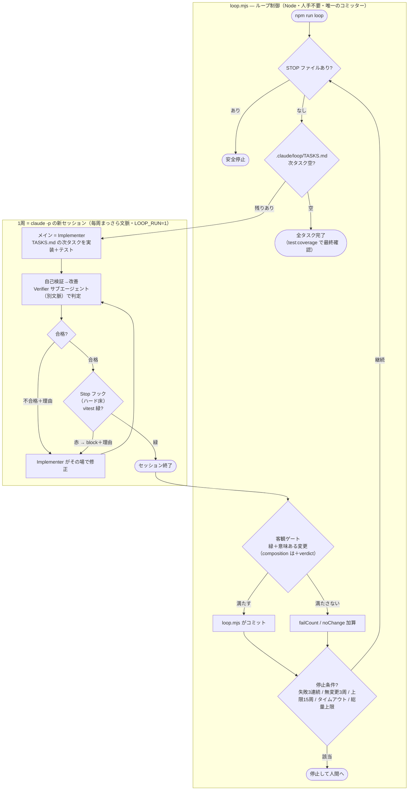

# HARNESS — 実用ループ機構（自前スクリプト）の設計

Claude をタスクごとに自走させ、安全に止まる Node スクリプトの設計。開発特化の自律ループ"土台（テンプレ）"。**使い方の入口は [README.md](README.md)**。このファイルは「仕組みをどう設計したか・どう拡張するか」の SoT。
作業規約は [CLAUDE.md](CLAUDE.md)、作業状態（機械が読み書き）は [.claude/loop/TASKS.md](.claude/loop/TASKS.md)。進捗・内部メタは作業メモ（非公開）に置く。

**配置ルール: `.claude/` ＝ ハーネス（ループ機構一式）／ それ以外 ＝ 開発ソース＋ドキュメント。**
利用者は ①客観ゲートのコマンド（テスト等）②タスクリスト（`.claude/loop/TASKS.md`）の2つを差し替えれば任意の開発リポで回せる。題材のタスク管理 API は同梱サンプル。

## 概観 — このループはどう回るか

1周＝1タスク、毎周まっさらな文脈。「**発動→実装→自己検証→改善→コミット**」を自動で回す。
役割は **Implementer（メイン）** と **Verifier（サブ）** の2体だけ。安全は3層で担保する:

1. **自己検証→改善（セッション内・自動）** — Implementer が Verifier を呼び、不合格なら自分で直して合格まで繰り返す。
2. **客観フロア（ハード強制）** — Stop フックが、テストが緑になるまでセッションを終わらせない（赤なら差し戻す）。
3. **コミットゲート＋反復＋ガードレール** — loop.mjs が緑＋意味ある変更でのみコミットし、暴走を止める。

- **3層の役割分担**: ①自己検証→改善（PROMPT 駆動・確実に動く）／②Stop フック（赤では終われないハード床・`claude -p` でも発火を実測確認済み）／③loop.mjs（最後の客観コミットゲート＋ガードレール）。
- **登場人物**: Implementer と Verifier の2体だけ。Explorer/Planner は出さない（小さなタスクには過剰）。
- **スキル再利用**: Verifier は判定の主軸を vitest緑・テスト品質・diff に置き、`/code-review`（あれば・low effort・読み取りのみ）を補助に使う（`/verify` は本リポ未設定なので使わない）。
- **客観ゲート**: コミットの是非は loop.mjs が「**テスト緑＋意味ある変更**（composition なら＋Verifier 合格）」で判定する（エージェントの自己申告で決めない）。詳細は §4。
- **baseline / composition**: Verifier ゲート（E〜H）を抜いた素のループが baseline、Verifier を足したのが composition（`--compose`）。Stop フック（客観フロア）は両モードで効く。

## 1. 目的とスコープ

**実際に使える「自前ループ機構」を作る** — Claude をタスクごとに自走させ、安全に止まる Node スクリプト（`.claude/loop/loop.mjs`）。
開発特化の自律ループ"土台（テンプレ）"であり、汎用でも3手法比較でもない（客観ゲート＝機械でチェックできる合否は、ソフト開発にしか綺麗に存在しないため開発に絞る）。
題材はタスク管理 API（Express）。`.claude/loop/TASKS.md` のサンプルタスクをループに実装させ、**実際に回ること**を確かめる。

- **作る対象 = 自前スクリプトのループ機構**（Ralph loop + 自己検証→改善 + Stop フック + 客観ゲート + ガードレール）。
- **/loop・/schedule は作らない**: Claude の標準機能で、仕組みを組む必要はなく**ただ回すだけ**。使い分けだけ示す（§7）。
- 方針: 良いパターンは出どころ問わず取り入れ、**実際に動かして確かめる**（教科書で終わらせない）。
- 背景: Zenn 記事（slug `6c7de76320b6d2`、未公開）「ループを組む」の実証も兼ねる。

## 2. 要件と達成基準（Definition of Done）

「完成＝OK」の基準。以後の判断はここを物差しにする。

**機能**: 自前ループが `.claude/loop/TASKS.md` のタスクを**ハンズオフで完成**させられる。完成時に `npx vitest run` 全緑／カバレッジ80%以上／API が `{ data, error }` 形式で動作。客観ゲート（緑＋意味ある変更でのみコミット）が実際に働く。
※ カバレッジ80%は**ループの完了処理が `npm run test:coverage` を自動実行**して担保（毎周は課さない）。

**安全**: 人間が確実に止められる（`loop:stop` / Ctrl+C / `kill`）。コミットはテスト緑のときだけ。Stop フックが赤では終わらせない。失敗ブレーカー・stuck検知・周回上限・タイムアウト・総量上限が効く。

**公開**: クリーンな1コミット・著者表記なし。`.claude/` 一式＋題材アプリ＋README/HARNESS を含める（WIP.md 等の作業メモは除く）。

## 3. 全体像

「ループを設計する＝目標を定め、トリガーを置き、暴走しないガードレールを組む」こと。構成要素:

| 要素 | 役割 | Ralph loop での対応 |
|------|------|---------------------|
| `CLAUDE.md` | 作業手順・規約（spec） | specs / AGENT.md |
| `.claude/loop/TASKS.md` | 作業状態・タスクリスト | fix_plan.md |
| `.claude/loop/loop.mjs` | ループ本体（Implementer を回す・唯一のコミッター） | while ループ |
| `.claude/loop/stop-hook.mjs` ＋ `.claude/settings.json` | Stop フック（赤では終われない客観フロア） | backpressure |
| `.claude/agents/verifier.md` | 検証役（サブエージェント・文脈隔離） | — |
| git + vitest | 外部検証（正しさの担保） | 外部状態 / backpressure |

**毎周まっさらにする理由**: 1つの長いセッションは文脈が積み上がって劣化・暴走する。毎周新しい `claude -p` で**文脈をリセット**し、記憶を `.claude/loop/TASKS.md`/git に限定することで安定する（再実行が自己レビューになり、だんだん正しくなる＝eventual consistency）。
永続ルールは初回プロンプトでなく CLAUDE.md に置く（毎リクエスト再注入され、圧縮で消えない）。

## 4. ループの仕組み（.claude/loop/loop.mjs）

Node 実装（クロスプラットフォーム・実装済み）。`claude -p` を1タスクずつ実行し、`.claude/loop/TASKS.md` が空になるまで回す。フロー図は冒頭「概観」を参照。

**1周の流れ**: ① Implementer（claude）が次タスクを実装し、**自己検証→改善を合格まで回す**（コミットはしない）→ ② Stop フックがテスト緑を強制してからセッション終了 → ③ loop.mjs が客観ゲートで判定 → ④ 条件を満たせば loop がコミット／満たさなければ加算 → ⑤ 完了判定 → 次へ。

### 3層オーケストレーション（発動→自己検証→改善→コミット）
1. **自己検証→改善（PROMPT 駆動・セッション内）**: loop.mjs の PROMPT が「実装→テスト→（composition は）verifier を呼ぶ→不合格なら直す→合格まで繰り返す→完了」を指示する。1回の `claude -p` 内で Implementer が自走する。これが「自動で回る」の本体。
2. **客観フロア（Stop フック・ハード強制）**: `.claude/settings.json` に登録した Stop フック（`.claude/loop/stop-hook.mjs`）が、claude が応答を終えようとした瞬間に発火。`npx vitest run` が緑でなければ `{"decision":"block","reason":...}` を返して**差し戻す**（緑になるまで終われない）。
   - **対話セッションを邪魔しない**: `LOOP_RUN=1`（loop.mjs が claude に渡す環境変数）のときだけ有効。普段の開発では no-op。
   - **無限ループ防止**: 入力 JSON の `stop_hook_active=true`（既定8回の連続ブロック上限・env `CLAUDE_CODE_STOP_HOOK_BLOCK_CAP` で調整）なら停止を許可。
   - `claude -p`（ヘッドレス）でも**発火することを実測確認済み**（公式に明記が無かったため smoke 前に検証した）。
3. **コミットゲート＋ガードレール（loop.mjs）**: 下記の客観ゲートでコミット可否を判定し、停止条件で暴走を止める。

**コミットの主体**: **loop.mjs が唯一のコミッター。** エージェントには「コミットしない（スクリプトが行う）」をプロンプトで指示する。万一エージェントが勝手にコミットしても、HEAD の変化で検知し `git reset --mixed` で巻き戻して（変更は作業ツリーに残す）再ゲートする（フェイルセーフ）。

**進捗の検知（porcelain ＋ HEAD）**:
- 主: `git status --porcelain -- src tests` で「意味ある変更」を見る。
- 副: `git rev-parse HEAD` を毎周比較し、規約違反コミットを検知（porcelain だけだと「勝手コミット→ツリーがクリーン→無変更と誤判定」になるため HEAD も見る）。

**コミット条件（客観ゲート）**: 次を**すべて**満たすときだけ loop がコミットする。
1. **意味ある変更がある**（`src/` か `tests/` に差分。`.claude/loop/` のログ・`verdict.json`・`STOP` は除外）
2. `npx vitest run` が**緑**
3. （composition のみ）**Verifier 合格**（`.claude/loop/verdict.json` を検証・§5）

満たさなければコミットしない。赤/不合格は failCount、変更ゼロは noChange を加算。コミットメッセージは loop が生成（日本語・著者表記なし）。
※「緑だが空実装」は ①（空コミット防止）＋②テスト緑＋カバレッジ＋③Verifier の役割分担で防ぐ。

**停止条件（ガードレール）**:
- 完了: `.claude/loop/TASKS.md`「次にやること」が空 **かつ** テスト緑
- 失敗ブレーカー: 赤/不合格が **3連続**で停止して人間へ
- stuck: 意味ある変更が **3周連続ゼロ**で停止
- 周回上限 `MAX_ITERATIONS`（15、試走は2-3）／ 1周タイムアウト `TIMEOUT_MS`（10分）
- 総量上限: 総経過時間（30分）超過で停止 ← 最後の砦
- コミット成功で failCount・noChange をリセット。

**人間が止める**: `npm run loop:stop`（`.claude/loop/STOP` ファイル）/ Ctrl+C / `kill <PID>`。
**npm scripts**: `loop`（本走）/ `loop:dry`（試走・claude を呼ばない）/ `loop:stop`（安全停止）。

> 設計原則: 一番シンプルなループから始める。終了は**検証可能な客観基準**で（自己申告でなく、テスト緑・タスク空）。

### 前提・初期化・リカバリ
- **前提**: claude CLI ログイン済み・実行可能 / Node ≥ 18 / リポルートから実行（パスはリポルート相対）。
- **権限**: 自律実行のため loop は `claude -p --dangerously-skip-permissions` で呼ぶ（既定権限だとヘッドレスで Edit/Bash/Agent/Skill が通らずループが機能しない）。暴走対策はガードレールで担保。管理された作業コピーで回す前提。
- **初期化**: scaffold やリセットは不要。自分のリポに `.claude/` 一式を置き、①客観ゲートのコマンド ②`.claude/loop/TASKS.md` のタスクリストの2点を差し替えれば既存コードに対して回せる。
- **リカバリ**: 止まったら `.claude/loop/loop.log` と直近 diff を確認 → `.claude/loop/TASKS.md` にメモ → 必要なら直近コミットを戻す（`git revert`）→ タスクを分割し直して再開。

## 5. エージェント構成

役割は安易に増やさない（サブエージェントは独立コンテキスト＝トークン増）。**最もシンプルな構成＋根拠の強い役割だけ**入れる。

### Implementer（= ループ本体）
各周回のメインセッション自身が実装者。専用サブエージェントは作らない（冗長）。PROMPT の指示で**自己検証→改善を合格まで自走**する（§4 の層1）。

### Verifier サブエージェント（本命）
**根拠（Coordinator-Implementer-Verifier）**: 「書いた本人が判定すると、エラーを生んだのと同じ思考で見逃す。検証は実装と別コンテキスト・別プロンプトで」。だから Verifier は**サブエージェント（文脈隔離）**にする。別モデルにできればなお良いが、根拠の本体は**文脈隔離**（同一モデルでも別セッションで判定する価値がある）。

**Ralph の自己レビューと両立する理由**: Ralph の「再実行で気づく」は**周回をまたいで**効く。Verifier は**その周回内でコミット前にゲート**する。作用するタイミングが違うので重複しない。

`.claude/agents/verifier.md`（実装済み・要点）:
- frontmatter: `name: verifier` / `model: sonnet` / `tools: Read, Bash, Grep, Glob, Skill`（Edit/Write を与えない。Bash があるので物理的には変更可能だが、変更・コミットしないのは prompt 規約で縛る。物理フェイルセーフは loop の HEAD 検知＋`git reset --mixed`）。
- description は「**ループのメインから明示的に呼ばれたときのみ起動**・自分からは起動しない」に限定（baseline での自動委譲を抑制）。
- 検証の主軸（この3つで判定）: ① git diff/status で今周回の変更を一次情報に（`.claude/loop/TASKS.md` の自己申告を鵜呑みにしない）／
  ② vitest 緑確認／③ **テスト品質**（今周回の変更が実際にテストでカバーされ受け入れ基準を assert しているか。空虚なテストは不合格）。
- 補助（使えれば）: `/code-review`（**low effort・`--fix`/`--comment`/ultra 禁止**。呼べなければ diff を自分で目視レビュー）。
  ※ `/verify` は本リポに `/run` スキル設定が無いので使わない（API 確認は Bash で起動＋curl）。
- **合否基準（pass）**: 全テスト緑＋今周回の変更がテストでカバー＋diff/レビューで **bug 級ゼロ**（軽微な指摘は reason に列挙するが pass を妨げない）。
- **カバレッジ80%の数値は毎周は課さない**（序盤は構造的に届かない）。80%は全タスク完了時の最終チェック（`npm run test:coverage` の閾値）で担保。
- 判定は `.claude/loop/verdict.json` に書く（`cd "$(git rev-parse --show-toplevel)" && echo '{"pass":..,"reason":..}' > .claude/loop/verdict.json`）。応答最後にも合否＋理由を述べる（呼び出し元の修正に使うため）。

**合否を loop に渡す**: Verifier が判定を `.claude/loop/verdict.json` に書き、loop がそれを読んでコミット条件3に使う（自己申告で終わらせない）。loop は claude 起動**直前に verdict.json を削除**し、起動後に**存在・スキーマ・新しさ**を検証。無い/不正なら**不合格扱い（fail-closed）**。`verdict.json` は `.gitignore`。

**baseline と composition**: loop.mjs の PROMPT は「共通プレフィックス＋差分」。共通に「自己検証→改善（テスト緑まで自分で直す）」と「コミットしない」を含め、composition（`--compose`）でのみ Verifier 起動＋verdict 出力＋verifier 合格までの改善ループを足す。

### 外した役割（外したこと自体が知見）
- **Explorer/調査**: 小さな CRUD で調べる物がほぼ無い → 低価値。
- **Planner/Architect**: `.claude/loop/TASKS.md` が既に計画、設計も自明 → 不要。
- **reviewer 専用エージェント**: Verifier が判定の中で（`/code-review` も補助に）兼ねるので不要 → 削除済み。
- 教訓: **役割は足すほど良いわけではない**。実際に動かして必要なものだけ入れる。

### 候補: Documenter サブエージェント
「**理解の負債** = 動くが、なぜ動くか誰も分からない」への対策。各変更の「なぜ動くか」を `.claude/loop/TASKS.md` 調査メモ等に残す役。
→ まず Verifier 1枚で動かし、必要を感じたら2枚目として足す（採用するなら測定方法も定義）。

## 6. スキル活用方針

既存スキルをサブエージェント（verifier）から**補助的に**再利用する。ただし主軸はスキルに依存しない。

- サブエージェントは Skill ツールでスキルを起動できる（公式: project/user/plugin スキル。bundled の `/code-review` 可否は明記が無く **smoke で要確認**）。
- 公式の使い分け: **Skill = メイン文脈で動く再利用ワークフロー** / **サブエージェント = 文脈隔離・ツール制限** / **フック = 決定的な強制（イベント駆動）**。
- `/code-review`: 引数なし=ローカル単一エージェント、`ultra` のみクラウド fleet、`--fix`/`--comment` で副作用。
  → verifier には **low effort・読み取りのみ（`--fix`/`--comment`/ultra 禁止）**。呼べなければ diff の目視で代替（判定は成立する）。
- `/verify`: `.claude/skills/run/SKILL.md`（`/run-skill-generator` で生成）が前提。本リポに無いので**使わない**（API 確認は Bash 起動＋curl）。
- スキルの結果は「指摘」であって合否ではない。**指摘→pass/fail のマッピングは verifier.md の合否基準で明文化**（bug 級ゼロで pass、軽微は reason に列挙）。
- カバレッジ80%は `vitest.config.js` の `coverage.thresholds` で強制。**毎周は課さず**、ループの**完了処理が `npm run test:coverage` を1回実行**して担保する（baseline/composition 両方で効く）。各周回の verifier は「変更がテストでカバーされているか（質）」を見る。

## 7. /loop・/schedule の使い分け（標準機能・作らない）＋ smoke 検証

**作るのは自前ループだけ。** /loop・/schedule は Claude の標準機能で仕組みを組む必要がない。用途で選ぶ:

| 手段 | こういう時に使う | 特徴 |
|------|------------------|------|
| **自前スクリプト**（本リポ） | 放置で確実に回す／コミットを客観ゲートする／挙動を完全制御する | 毎周まっさら・自己検証→改善・Stop フックで緑強制・テスト緑ゲート・各種ガードレール |
| **/loop**（標準） | 対話で見ながら短く回す | 永続セッション・スクリプト的ゲート不可・閉じると止まる |
| **/schedule**（標準） | PC を閉じてもクラウドで定期実行する | クラウド Routine・最小1時間・要 push |

**smoke 検証**: いきなり全タスクを回さず、まず**1タスクだけ**動かして確かめる。合格条件（すべて満たす）:
- 権限フラグでメインが一通り実行できた（Edit/Bash/Agent/Skill が通った）
- 自己検証→改善が回った（実装→テスト／verifier→不合格なら自分で修正→合格）
- Stop フックが効いた（テスト赤では終われず差し戻す。緑で終了）
- 客観ゲートが働いた（緑＋意味ある変更でのみコミット／赤なら止まる）
- そのタスクが緑で完了・コミットされた
- （composition）Verifier が呼ばれ `.claude/loop/verdict.json` を**新しく正しいスキーマで**書けた／`/code-review` がサブエージェントから呼べたか（呼べなくても主軸で判定が成立したか）
- 1周のコスト/時間を**観察**（現状は自動計測が未実装なので合否ゲートにはせず、目安として記録）

合格なら `MAX_ITERATIONS=2-3` で短く → フル。`/code-review` が重すぎるなら軽い検証指示に差し替え。
※ コスト計測は `claude -p --output-format json` の `usage`/`total_cost_usd` を取得・合算する方式（現状は未実装。`stdio:inherit` を出力取得方式に変える必要あり）。

## 8. 根拠・出典

- Ralph loop（while ループでエージェントを回す技法、毎周まっさら文脈）:
  https://ghuntley.com/ralph/ ／ https://ghuntley.com/loop/ ／ https://github.com/snarktank/ralph
- Coordinator-Implementer-Verifier（判定は実装と別コンテキストで）:
  https://www.augmentcode.com/guides/agentic-sdlc-coordinator
- Loop Engineering ガイド（最小ループから / 検証可能な終了条件）:
  https://datasciencedojo.com/blog/agentic-loops-explained-from-react-to-loop-engineering-2026-guide/
- 公式: Agent SDK loop（max_turns / max_budget_usd / 自動コンパクション）:
  https://code.claude.com/docs/en/agent-sdk/agent-loop
- 公式: フック（Stop フックの decision:block / stop_hook_active / 既定8回のブロック上限・env `CLAUDE_CODE_STOP_HOOK_BLOCK_CAP`）:
  https://code.claude.com/docs/en/hooks-guide.md （"Stop hook hits the block cap"）／ https://code.claude.com/docs/en/hooks.md ／ https://code.claude.com/docs/en/env-vars
- 公式: サブエージェント / スキル: https://code.claude.com/docs/en/sub-agents.md ／ https://code.claude.com/docs/en/skills.md

## 9. 実走で分かったこと（運用上の学び）

実際にループを回して得た知見。テンプレを自分のプロジェクトに適用する人にも効く。

- **壊れたコードはコミットされず安全に止まる**。失敗注入（vitest を確定赤にして実走）で確認: 周回1 `[失敗]赤→コミットせず`、周回2 `[停止]タスク空だが赤`、HEAD 不変。停止経路は状況次第（失敗ブレーカー / completion で赤 / stuck）だが、共通して「赤はコミットしない・止まる」。
- **客観ゲートは単発の `npx vitest run` を信頼する → スイートの flaky は致命的**（偽差し戻し／偽失敗になる）。本リポにも CJS/ESM 混在由来の二重インスタンス flaky があり（`describe` で `runner.config` が undefined）、retry で隠さず根本修正した（`globals: true` ＋ テストの vitest import 削除）。教訓: flaky は retry で誤魔化さず根本を直す。
- **ヘッドレス `claude -p` は人に聞けない**。曖昧な指示だとエージェントが確認しようとして、答えが無いまま自分で判断して進む。タスクは曖昧さを残さず書く。
- **off-limits 指定は尊重された**。「このファイルは触るな」と書けば、エージェントは（そのファイル自身が削除を促していても）触らなかった。
