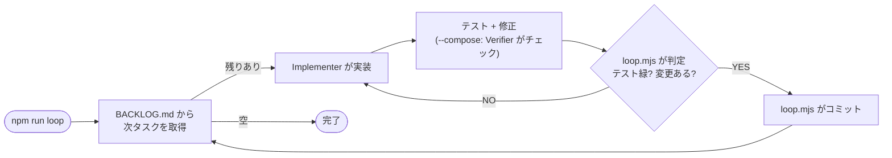

# loop-engineering-playbook

AI が自動でコードを書いてコミットする仕組みのテンプレート。

人間は放置してOK。タスクリストが空になるまで、AI（Claude）が1つずつ実装 → テスト → コミットを繰り返す。テストが通らなければコミットしないし、直せなければ止まって人間に返す。

> 設計の詳細・アーキ図・出典は [HARNESS.md](HARNESS.md)。

## 登場人物

| 誰 | 何をする |
|---|---|
| **loop.mjs**（監督） | Claude を毎回呼び出して、テストが通ったらコミットする。暴走しないように見張る |
| **Implementer**（実装する人 = Claude 本体） | タスクを1つ受け取って、コードとテストを書く |
| **Verifier**（チェック役 = 別の Claude） | `--compose` 時のみ。Implementer が書いたコードを別の目でチェックする |

基本（`npm run loop`）では Implementer が自分でテストを回して直す。`npm run loop -- --compose` で起動すると、さらに別の Claude（Verifier）が独立した目で「本当にこれでいいか?」をチェックする。不合格なら Implementer がその場で修正して、合格するまでやり直す。精度は上がるがその分時間とコストがかかる。

## どう回るの?



`.claude/loop/BACKLOG.md` にタスクが箇条書きで並んでいる。ループが先頭から1つずつ取り出して実装し、終わったら Claude が完了に移動する。

## 安全に止まる仕組み

放置するから暴走が怖い。だから何重もの安全装置がある。

- **テストが赤なら絶対にコミットされない** -- 壊れたコードは入らない
- **3回連続失敗で停止** -- 直せないなら人間に返す
- **15回繰り返したら強制終了** -- 無限ループ防止
- **30分で強制終了** -- 最後の砦
- **`npm run loop:stop` / Ctrl+C** -- 人間がいつでも止められる

## 前提

- Node.js 18 以上
- Claude CLI（`claude` コマンドが使える・ログイン済み）
- リポジトリのルートから実行すること
- ループは `claude -p --dangerously-skip-permissions` で AI を呼ぶ（ヘッドレスでファイル編集やコマンド実行を許可するために必要）。壊れてもいい環境（専用ブランチやクローン）で回すこと

## 使い方

サンプルのタスクが入っているので、そのまま動かせる。

```
npm install
npm run loop              # ループを回す（基本）
npm run loop -- --compose # チェック役（Verifier）込みで回す
npm run loop:dry          # AI を呼ばずスクリプトの動作だけ確認
npm run loop:stop         # 安全停止
```

タスクリストが空になるまで1つずつ進む。最後にループがテストのカバレッジ80%以上かを自動チェックする（未達なら停止して報告）。

タスクは `.claude/loop/BACKLOG.md` に手書きしてもいいし、`/groom` で Claude と対話しながら生成・追記もできる（リポと規約を読んで、曖昧な点を質問しつつ、ループが回せる粒度に分解してくれる）。

## 同梱サンプル

ループの仕組みを試すための**お題**として、Express のタスク管理 API（ポート3001）を同梱。すでに動く実装が入っていて、タスクリストに並んだ新機能をループが1つずつ進める。中身は重要じゃないので、自分のプロジェクトで使うときは丸ごと差し替えてOK。

## 自分のプロジェクトで使うには

このリポの `.claude/` フォルダを自分のリポにコピーして、大きく**2つ差し替える**:

1. **テストコマンド** -- 合否を判定するコマンド（このリポは `npx vitest run`）。`.claude/loop/loop.mjs`・`.claude/loop/stop-hook.mjs`・`package.json` の `test`/`test:coverage` など複数箇所にあるので、それぞれ自分のテストコマンドに直す
2. **タスクリスト** -- `.claude/loop/BACKLOG.md` の「次にやること」に、やりたいタスクを並べる（手書きのほか `/groom` で対話生成も可）

`src/`・`tests/` のパスも `.claude/loop/loop.mjs` や `CLAUDE.md` にハードコードされているので、別レイアウト（例: `app/`・pytest）なら合わせて調整する。

あとは `npm run loop`。

## ドキュメントマップ

| ファイル | 役割 |
|---|---|
| [README.md](README.md) | 入口。何これ? どう使う?（このファイル） |
| [HARNESS.md](HARNESS.md) | 設計の全部。なぜこう作ったか・アーキ図・出典 |
| [CLAUDE.md](CLAUDE.md) | AI への作業手順・コーディング規約 |
| [.claude/](.claude/) | ループ機構一式（エンジン・フック・チェック役・タスクリスト・`/groom` スキル） |
| [src/](src/) ・ [tests/](tests/) | 同梱サンプル（丸ごと差し替え可） |

## Author

週末ものづくり部 — [@shumatsumonobu](https://x.com/shumatsumonobu)

## License

MIT — see [LICENSE](LICENSE)
