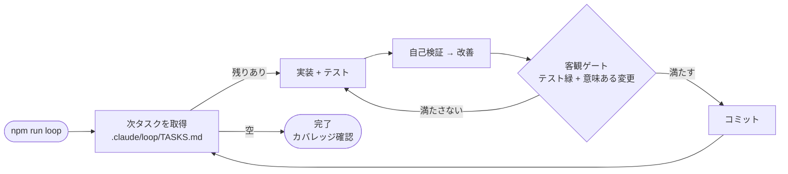

# loop-engineering-playbook

開発向けの「自律コーディングループ」の土台（テンプレ）。
AI（Claude）をヘッドレスで回し、タスクを1つずつ **実装 → 自己検証 → 改善 → 客観ゲート通過でコミット** まで自動で進める仕組み。人が張り付かなくても、テストの緑という客観的な合否を基準に AI が自分で実装・検証・修正を繰り返す。

「Loop Engineering を始める人の出発点」になることを狙った最小構成。客観ゲートが効く領域＝ソフトウェア開発に絞っている。

> 仕組みの完全な設計・詳細アーキ図は [HARNESS.md](HARNESS.md)。

## 全体フロー

## 前提

- Node.js（18 以上）
- Claude CLI（`claude` がコマンドとして使える・ログイン済み）
- リポジトリのルートから実行すること
- ループは `claude -p --dangerously-skip-permissions` で AI を呼ぶ。**管理された作業コピー**で回す前提（暴走対策はガードレールで担保）。

## 使い方

`.claude/loop/TASKS.md` にサンプルのタスクが seed 済みなので、そのまま動かせる。

    npm install
    npm run loop              # 自律ループを回す（baseline）
    npm run loop -- --compose # verifier 込みで回す（composition）
    npm run loop:dry          # AI を呼ばず配線だけ確認
    npm run loop:stop         # 安全停止（他に Ctrl+C / kill <PID>）

`.claude/loop/TASKS.md` の「次にやること」が空になるまで1タスクずつ進み、最後にテスト緑＋カバレッジ80%を確認して終わる。

## 自分のプロジェクトで使うには

scaffold やリセットは要らない。**自分のリポに `.claude/` 一式を置き、差し替えるのは概念的に2つ**:

1. **客観ゲートのコマンド** — テスト/ビルド/型/lint など、機械的に合否が出るもの（このリポは `npx vitest run`）。差し替え箇所は `.claude/loop/loop.mjs`・`.claude/loop/stop-hook.mjs`・`package.json` の `test`/`test:coverage` の複数箇所。
2. **タスクリスト** — `.claude/loop/TASKS.md` の「次にやること」に、回したいタスクを箇条書きで並べる。

> 概念は2つだが、実際の差し替え面はもう少し広い。テストコマンドは上記の複数箇所にあり、`src/`・`tests/` のパスは `loop.mjs` と各プロンプト（`CLAUDE.md`）にハードコードされている。別レイアウト（例: `app/`・pytest）なら、これらのパスも自分の構成に合わせて調整する。

あとは `npm run loop`。ループはあなたのリポの既存コードに対して1タスクずつ進める。

## 仕組み（設計の柱）

- **Ralph パターン**: 毎回まっさらな文脈で AI を起動。状態はファイル（`.claude/loop/TASKS.md` / git / テスト）に残す。
- **客観ゲート**: 機械でチェックできる合否（テスト緑＋意味ある変更）でのみコミット。AI の自己申告では進めない。
- **検証は別文脈**: 実装役とは別の verifier（サブエージェント）が合否を判定し `verdict.json` に書く。
- **Stop フック（ハード床）**: テストが赤いまま完了しようとすると差し戻す。実装役が緑を確認せず終わるのを防ぐ。ループ実行時（`LOOP_RUN=1`）だけ作動し、対話セッションは邪魔しない。
- **ガードレール**: STOP ファイル / 周回上限 / 失敗ブレーカー / 無変更（stuck）/ タイムアウト / 総量上限で暴走を止める。loop が唯一のコミッターで、AI が勝手にコミットしても巻き戻す。

## 構成

**配置ルール: `.claude/` ＝ ハーネス一式（ループ機構そのもの）／ それ以外 ＝ 開発ソース＋ドキュメント。** 設計の根拠は [HARNESS.md](HARNESS.md)。

`.claude/` の主な中身:

- `loop/loop.mjs` … エンジン（客観ゲート・コミット・ガードレール）
- `loop/stop-hook.mjs` ＋ `settings.json` … Stop フック
- `agents/verifier.md` … 検証役サブエージェント
- `loop/TASKS.md` … タスク待ち行列＋作業状態（AI が自分で更新する）

## 同梱サンプル

土台を体験するための題材として、Express のタスク管理 API（ポート3001）を `src/` `tests/` に同梱。**すでに動く実装が入っており**、`.claude/loop/TASKS.md` のバックログ（新機能の追加・修正タスク）をループが1つずつ進める対象。中身そのものは重要でないので、自分のプロジェクトで使うときは丸ごと差し替えてよい。

## もっと詳しく

設計の意図・3層オーケストラ・出典は [HARNESS.md](HARNESS.md) に。

## ドキュメントマップ

| ファイル | 役割 |
|---|---|
| [README.md](README.md) | 入口。前提・使い方・全体フロー（このファイル） |
| [HARNESS.md](HARNESS.md) | ハーネス（loop/フック/verifier）の完全な設計・詳細アーキ図・出典 |
| [CLAUDE.md](CLAUDE.md) | 作業手順・規約・ドキュメント体制（SoT）地図 |
| [.claude/](.claude/) | ハーネス一式（エンジン・Stop フック・検証役・タスク待ち行列） |
| [src/](src/) ・ [tests/](tests/) | 同梱サンプル（題材アプリ・丸ごと差し替え可） |

## Author

週末ものづくり部 — [@shumatsumonobu](https://x.com/shumatsumonobu)

## License

MIT — see [LICENSE](LICENSE)
