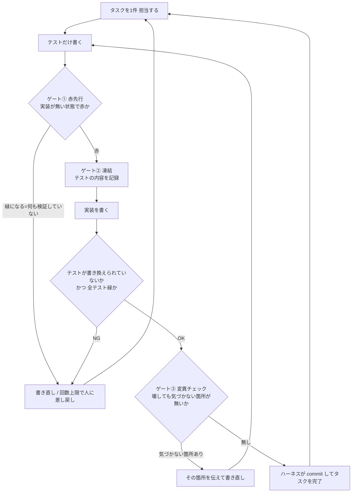

# loop-engineering-playbook

**AI にコードを書かせ続けるループを、人が毎回レビューしなくても信用できる形で1本 作って実証したもの ── 手元のプロジェクトにそのまま導入できる**

タスクの文章を1つ渡すと、AI が実装とテストを書き、自動の判定に合格したものだけがコミットされる

指示を出し直す作業を人が繰り返すのではなく、AI が自律的に働き続けられる仕組みそのものを設計する ── リポジトリ名の**ループエンジニアリング**はこの考え方を指している

このリポジトリに入っているもの

- **ハーネス** ── ループを回すスクリプト（[harness/integrated.mjs](harness/integrated.mjs)）、`claude` を呼び出して合否を判定する側、手元のプロジェクトに導入して回せる（[導入先の要件](#導入先の要件)あり）
- **実際に回した題材3つ** ── そのまま複製して試せる一式（[sample/](sample/)）
- **検証の記録** ── 各段階で何を確かめたか・実測のコストと時間（[proof/](proof/)）

AI にコードを書かせると テストも AI が書く、だが AI は**実行は通るが何も検証していないテスト**を平気で書く（例 `expect(true).toBe(true)`）

行カバレッジ100%・全テストが通っていても、肝心の戻り値を一度も確認していないことがある

だから**テストの質そのものを採点するゲートを置く** ── 実装を機械的に1箇所ずつ壊し、テストが気づくかを調べる（`return "zero"` を `return ""` に書き換えても全テストが通るなら、そこを検証しているテストは1本も無い）

これは**変異テスト**という手法、このループでは[3つのゲート](#3つのゲート)の③ **変異チェック**がこれをやる

気づかない壊し方が1つでもあれば不合格、そのタスクはコミットされない

## 仕組み

以降、テストが全部通る状態を**緑**、1つでも落ちる状態を**赤**と呼ぶ

### 人と AI の役割

- ループを回している間、人が書くのは タスクの文章だけ、コードとテストは AI（`claude`）が書く ── この `claude` のプロセスを**ワーカー**と呼ぶ
- AI の自己申告は信用しない、テストの実行も 変異チェックも ハーネスが自分で実行する

やることの管理には [beads](https://github.com/gastownhall/beads)（`bd`）というタスク管理ツールを使う、**操作ごとに誰がやるかが決まっている**

| 操作 | 誰が |
|---|---|
| タスクを登録する（`bd create`） | **人** |
| 担当を割り当てる（`bd update --claim`） | ハーネス |
| テストとコードを書く | ワーカー（成果物の置き場所（既定 `src/`）と `tests/` だけ） |
| 成果を保存する（`git commit`） | **ハーネスだけ** |
| タスクを完了にする（`bd close`） | **ハーネスだけ**（合格した後） |
| 差し戻されたタスクを見る（`bd list --label blocked-for-human`） | **人** |

ワーカーは複数 動かせる

- ワーカーごとに別の作業コピー（git worktree）を持ち 互いのファイルを触らない
- 1つのタスクを担当するワーカーは1つだけ、同じタスクを複数が同時に進めることは起きない

### 1タスクの流れ

- 「テストを書く → 実装前に赤を確認 → テストの内容を記録 → 実装 → 変異チェック」の順に進む（下の図）、順序を管理するのは AI ではなくハーネス
- 3つのゲート（赤先行・凍結・変異チェック ── 中身は[下の表](#3つのゲート)）に全部合格したら commit してタスクを完了、落ち続けたら人に差し戻し
- 終わったブランチは1本ずつ元のブランチに統合、そのたび全テストを走らせ直し 緑なら採用・赤なら巻き戻し


```mermaid
flowchart TD
    A["タスクを1件 担当する"] --> B["テストだけ書く"]
    B --> C{"ゲート① 赤先行<br/>実装が無い状態で赤か"}
    C -->|緑になる=何も検証していない| P["書き直し / 回数上限で人に差し戻し"]
    C -->|赤| D["ゲート② 凍結<br/>テストの内容を記録"]
    D --> E["実装を書く"]
    E --> F{"テストが書き換えられていないか<br/>かつ 全テスト緑か"}
    F -->|NG| P
    F -->|OK| G{"ゲート③ 変異チェック<br/>壊しても気づかない箇所が無いか"}
    G -->|気づかない箇所あり| R["その箇所を伝えて書き直し"]
    R --> B
    G -->|無し| S["ハーネスが commit してタスクを完了"]
    S --> A
    P --> A
```

### 3つのゲート

順に通し、1つでも落ちたらそのタスクはコミットされない

| ゲート | 判定 |
|---|---|
| **① 赤先行** | 実装が無い状態でテストを実行し、緑になってしまうなら不合格（何も検証していない）|
| **② 凍結** | 実装前の `tests/` 全部の内容を記録しておき、実装中に1文字でも書き換えられていたら不合格（テストを弱めて通す不正を防ぐ・今回のタスクと無関係な既存テストも対象）|
| **③ 変異チェック** | 実装を機械的に1箇所ずつ壊し、どれかの壊し方に全テストが緑のままなら不合格（JavaScript / TypeScript は Stryker、他の言語は[自分で書いたものに差し替え](#変異チェックの差し替え-成果物を壊すプログラムを自分で書く)）|

①と②はセットで機能する、片方だけだと実装中にテストを弱めて通せてしまう

③で緑のままだった壊し方を**生き残り**と呼ぶ、生き残りが1つでもあれば不合格

補助が2つ

- **自己チェック**（Stryker を使う時だけ）── 変異ツール自体が実コードで壊れて誤判定することがあるため、生き残りを素のテスト実行で検算する
- **人への差し戻し** ── 落ち続けたタスクだけ人に戻す（既定は最大6回・環境変数 `MAX_ATTEMPTS` と `MAX_ROUNDS` で変えられる）、ループ全体は止まらない

### 規約違反への対処

役割を決めただけでは守れない ── ワーカーは自分の作業コピーの中で `git` も `bd` も動かせるし、実装ファイルには何でも書ける、だからハーネスが呼び出しの前後で調べて元へ戻す

| ワーカーがやること | ハーネスの対応 |
|---|---|
| 自分で commit する | 取り消す（中身は残してゲートで判定させる）|
| 自分でタスクを閉じる | 開け直す（閉じられると 差し戻した失敗が人の一覧から消える）|
| 成果物の置き場所と `tests/` の外を書き換える（設定・テストコマンド）| 元へ戻す（判定の材料を採点される側に触らせない）|
| 変異チェックを黙らせる印（`// Stryker disable`）を書く | 不合格にする |

ゲート②が防ぐ「既存テストの改変」も含めて、どれも**実際に迂回できることを確かめてから塞いだ**、再検証は [proof/stub-worker-attack.mjs](proof/stub-worker-attack.mjs) で $0 で回せる

守るのは**規約を破る**ところまで、**悪意を持って壊しにくる相手は対象外**（→ [既知の限界](#既知の限界)）

### 使用ツール

| ツール | 何のツールか | ここでの役割 |
|---|---|---|
| [Node.js](https://nodejs.org) | JavaScript の実行環境 | ハーネスを動かす |
| [Claude Code](https://code.claude.com/docs)（`claude -p`） | Anthropic 公式の AI コーディングエージェント | CLI で呼び出し、コードとテストを書く役（ワーカー） |
| [beads](https://github.com/gastownhall/beads)（`bd`） | AI エージェント向けのタスク管理ツール | タスクの登録と 担当の割り当て |
| [git worktree](https://git-scm.com/docs/git-worktree) | 1つのリポジトリから複数の作業コピーを作れる git 機能 | ワーカーごとの作業コピーを分離 |
| [Vitest](https://vitest.dev) | Vite ベースのテストフレームワーク | テストの実行と合否判定（**導入先が JavaScript の場合**、Python なら pytest など） |
| [Stryker](https://stryker-mutator.io) | 変異テストツール（JavaScript/TypeScript・C#・Scala に対応） | 実装を機械的に壊してテストの穴を見つける（**それ以外の言語は自分で書いたものに差し替え**） |

## ユーザガイド

**何を作らせるかで「合格」の意味が変わる** ── 3つのゲートが見るのはテストの結果だけ、テストで検証できないことは合格に含まれない

- **コード** ── テストが振る舞い（入力に対する出力）を検証できるので、**合格したら完成として扱える**（[sample/express-api/](sample/express-api/) の形）
- **記事・文書** ── テストで検証できるのは形式（要素の有無・構造）だけ、**合格しても中身が正しいかは自分で読む**（[sample/article-loop/](sample/article-loop/) の形）
- **テストが書けないもの**（リサーチ・作る/作らないの判定）── **回せない**、ゲートを外す設定は無い

回せないものでも、テストが書ける部分だけをタスクに切り出す手はある

向くのは**独立した小さいモジュールの追加**、既存の大きいファイルの改変は通しにくい ── 変異チェックは変更したファイルの**全行**に走るため、今回の修正と無関係な既存の未検証箇所まで生き残りとして報告される

1タスクあたり **$0.41〜$6.74**、一番高いのは失敗した走（[コストと時間](#コストと時間)）

### 導入先の要件

**ソースコードの言語は問わない** ── ハーネスは導入先のリポジトリで `npm install` と `npm test` を実行するだけで、テストの中身は何でもよい（実測は JavaScript が大半、TypeScript 2走、Python は1走）

言語で変わるのは**変異チェック（ゲート③）だけ** ── [Stryker](https://stryker-mutator.io) が JavaScript/TypeScript・C#・Scala 専用なので、それ以外の言語では自分で用意することになる（下の[それ以外の言語の場合](#それ以外の言語の場合-変異チェックだけ自分で書く)）

#### 言語に関係なく必須

| 要件 | 外れている場合 |
|---|---|
| Node.js と、導入先の `package.json` に `scripts.test` | `scripts.test` が無いと `npm test` が失敗し続けて全タスクが人に差し戻される、中身は `vitest run` でも `python -m pytest -q` でもよい |
| テストが `tests/` にある | `tests/` は固定なので移動が要る（成果物の側は `WORK_ROOT` で変えられる・既定は `src/`） |
| 最初に全テストが緑 | 赤いテストがあると全ワーカーのゲートが道連れで落ちる |
| テスト一式が2分以内に終わる | ハーネスが `npm test` を120秒・変異チェックを900秒で打ち切って赤扱いにするため、超えると全タスクが差し戻される（[harness/integrated.mjs](harness/integrated.mjs) の `T` を変える＝ハーネスの改造） |

#### JavaScript / TypeScript の場合 ── Stryker をそのまま使える

| 追加の要件 | 外れている場合 |
|---|---|
| テストランナーが [Vitest](https://vitest.dev) | [Jest](https://jestjs.io) でも通る（実測 $0.81・変異9個中 生き残り0）、設定の差し替えと環境変数が要る（下の[Jest の場合](#jest-の場合-設定の差し替えと環境変数)） |
| ESM（`package.json` に `"type": "module"`）| CommonJS なら `import` / `export` へ書き換える（下の[セットアップ](#セットアップ)で）、そのままだと Stryker が変異を効かせられず 生き残りが誤検出される（実測は [proof/README.md](proof/README.md)） |

**TypeScript は改造なしで通る**（実測 $0.90・変異13個中 生き残り0）── ただし**ゲートは `npm test` を呼ぶだけで、型チェックは見ていない**、型も守りたいなら `"test"` を `tsc --noEmit && vitest run` にする

#### それ以外の言語の場合 ── 変異チェックだけ自分で書く

**ESM も Vitest も要らない**（どちらも Stryker のための要件）、ハーネスの改造も要らない

成果物を壊すプログラムを1本 書いて差し替える（書き方は下の[変異チェックの差し替え](#変異チェックの差し替え-成果物を壊すプログラムを自分で書く)）

自作した場合、壊し方の網羅性は自分で書いた分だけ → [既知の限界](#既知の限界)

### セットアップ

**この手順は JavaScript / TypeScript・テストランナーが Vitest のプロジェクト向け**

構成が違うなら、**手順に入る前に**下の2節を読む ── どちらも手順の中でやることが変わる

- テストランナーが Jest → [Jest の場合](#jest-の場合-設定の差し替えと環境変数)（依存とテストコマンドの設定が変わる）
- JavaScript 以外の言語・コード以外の成果物 → [変異チェックの差し替え](#変異チェックの差し替え-成果物を壊すプログラムを自分で書く)（どこがどう変わるかの対応表と一式は [sample/python-pytest/](sample/python-pytest/)）

前提は Node.js 20 以上・git・[Claude Code](https://code.claude.com/docs)（beads は下の1つ目で入れる）── Node 20 以上は 下で入れる Vitest と Stryker の要求、実走は Node 24 で検証

ここでの**プロジェクト**は ループを回したいリポジトリ、**ハーネス**は clone した `loop-engineering-playbook`

コマンドは 各手順に書いてあるルートで実行する

**プロジェクト側で用意・変更するもの**（ハーネスは書き換えない）

**JS/TS 専用** の印が付いた行は、構成によって別のことをする（[Jest の場合](#jest-の場合-設定の差し替えと環境変数)／[変異チェックの差し替え](#変異チェックの差し替え-成果物を壊すプログラムを自分で書く)）

| 対象 | すること | 手順 |
|---|---|---|
| `package.json` | `"test"` にテストコマンドを書く、**JS/TS 専用** ── `"type": "module"` と 開発依存の Vitest・Stryker | 3・5・6 |
| 既存のコード | **JS/TS 専用** ── CommonJS なら `import` / `export` へ書き換え | 5 |
| 成果物の置き場所 | `src/` に置く（別の場所なら環境変数 `WORK_ROOT` で指定） | 4 |
| テストの置き場所 | `tests/` に置く（固定・別の場所にあるなら移動） | 4 |
| `stryker.config.json` | **JS/TS 専用** ── ハーネスからコピーして直下へ（他の言語では代わりに 成果物を壊すプログラムを1本 書く） | 7 |
| `CLAUDE.md` | コーディング規約を追記 | 8 |
| `.gitignore` | ツールが作る未追跡ファイルを除外 | 10 |

1. **beads をインストール**（グローバルに入るので1回だけ）

   ```bash
   npm install -g @beads/bd@1.1.0   # 検証済みの版、Homebrew なら brew install beads
   ```

2. **ハーネスを取得**（置き場所は任意）

   ```bash
   git clone https://github.com/shumatsumonobu/loop-engineering-playbook
   ```

3. **プロジェクトのルートで 依存を追加して beads を初期化**

   ```bash
   cd /path/to/my-repo   # ループを回したいプロジェクトのルート
   npm install -D vitest@4.1.10 @stryker-mutator/core@9.6.1 @stryker-mutator/vitest-runner@9.6.1   # 検証済みの版
   bd init
   ```

   `bd init` は `.beads/`・`AGENTS.md`・`.agents/`・`.codex/`・`CLAUDE.md`・`.gitignore`・`.claude/settings.json` を作って自分でコミットする（**既にあるファイルは消さずに追記する**）

4. **プロジェクトの成果物とテストの置き場所を合わせる**

   成果物は `src/`・テストは `tests/` に配置、ハーネスが見るのはこの2つだけ

   成果物の置き場所を変えたい場合は 環境変数 `WORK_ROOT` にディレクトリ名を渡す（既定 `src`・例 `WORK_ROOT=app`）

   テストは `tests/` 固定、既存のテストが `test/` や `__tests__/` にあるなら `tests/` へ移す

   ファイル名は自由（**JS/TS 専用** ── Vitest は `*.test.js` も `*.spec.js` も拾うので改名は要らない）

5. **プロジェクトを ESM に設定**

   package.json に `"type": "module"` を追加

   既存コードが CommonJS（`require` / `module.exports`）なら **`import` / `export` へ書き換える**、`"type": "module"` を足しただけでは動かない

   書き換えるのは**リポジトリ全体**、ハーネスが触らないファイル（ビルドスクリプトなど）も `"type": "module"` の影響を受けて `require` が動かなくなる

   TypeScript なら `tsconfig.json` も合わせる ── `"module"` と `"moduleResolution"` を `nodenext` にして、相対 import に `.js` 拡張子を付ける（`from "./money.js"`）

   `"type": "module"` を足しただけだと `tsc` が出力するコードは CommonJS のままで実行できなくなる、**`tsc --noEmit` は緑のままなので気づけない**

6. **プロジェクトのテストコマンドを設定**

   package.json の scripts に `"test": "vitest run"` を追加

   TypeScript で型もゲートに含めたいなら `"test": "tsc --noEmit && vitest run"` にする（ゲートが見るのは `npm test` の結果だけ）

   テストが1本も無い場合は、既にある関数を1つ選んで `tests/` にテストを1本書く（vitest はテスト0本だと失敗する）、コード以外が成果物なら 既にある成果物を1つ検証するテストを1本

   確認: `npm test` で全テストが緑になる

7. **Stryker の設定をプロジェクトへコピー**

   [harness/stryker.config.json](harness/stryker.config.json) をプロジェクトの直下へ置く

   設定の `mutate` は書き換えなくて良い ── 変異の対象はハーネスが実行時に「そのタスクで変更したファイル」を指定する（`mutate` が効くのは手で `npx stryker run` を叩く時）

8. **プロジェクトの CLAUDE.md にコーディング規約を追加**

   書くのはプロジェクト固有の規約だけ（ループの動作指示はハーネスがプロンプトで渡すので要らない）

   推奨は次の2つ、どちらも 変異チェックが不合格を出しやすい書き方の予防

   ```markdown
   ## コーディング規約
   - エラーを検証するテストは 文言の全文を固定しない、文言の一部だけを部分一致で検証する（例 `toThrow(/min/)`）
   - テストが要求していない分岐や 念のためのガードを実装に書かない
   ```

   `bd init` が追記した `## Session Completion` の項目「**File issues for remaining work**」は消す ── タスクを決めるのは人なので、ワーカーが作業の終わりに issue を立てる必要は無い（消し忘れてもハーネスが検出して閉じる）

   実際に使った例は [sample/express-api/CLAUDE.md](sample/express-api/CLAUDE.md)

9. **プロジェクトのルートで タスクを登録**

   ```bash
   bd create "URLスラッグへの変換を実装" -d "src/slugify.js に 文字列をURLスラッグへ変換する slugify(s) を実装し、tests/slugify.test.js で 空文字・記号・連続スペースまで検証する"
   ```

   `-d`（説明）に書いた文章がそのまま AI への仕様になる、「どのファイルに・何を・どうテストするか」まで書く

   題名は 500バイト（日本語なら約160文字）までしか入らない、ハーネスは題名と説明の両方をワーカーへ渡す

10. **プロジェクトの未コミットの変更を無くす**

    ハーネスは 今のコミット状態から作業コピーを作るため、未コミットの変更は反映されない

    `npm install` で生まれた `package-lock.json` はコミットする、使っているツールが勝手に作ったファイル（`.serena/` など）が未追跡で残っていたら `.gitignore` へ入れる

    確認: `git status` に変更が残っていない ── 残したまま次へ進むと**警告も出ずに古い状態で回る**

### Jest の場合 ── 設定の差し替えと環境変数

テストランナーが [Jest](https://jestjs.io) でも通る、Vitest との違いは2つ

- `stryker.config.json` の `"testRunner"` を `"jest"` にして `@stryker-mutator/jest-runner` を開発依存に足す
- **ESM の Jest には `NODE_OPTIONS=--experimental-vm-modules` が要る** ── `npm test` 側だけでなく**ハーネスを起動する時にも渡す**（Stryker は自分で Jest を起動するため、無いと変異チェックが初回実行で落ちる）

```bash
NODE_OPTIONS=--experimental-vm-modules BASE=/path/to/my-repo node harness/integrated.mjs
```

### 変異チェックの差し替え ── 成果物を壊すプログラムを自分で書く

Stryker が使えない言語（Python など）と、コード以外の成果物（markdown の記事など）では、成果物を壊すプログラムを自分で書いて `MUTATOR` で差し替える

やることは3つ

1. **`package.json` を1つ置く** ── 中身は `{"scripts": {"test": "<自分のテストコマンド>"}}` だけでいい（例 `python -m pytest -q`）
2. **成果物を壊すプログラムを `.mjs` で1本 書く**（以下 **変異器**・書き方は下）── 実例 [mutate-py.mjs](sample/python-pytest/mutate-py.mjs)（Python）／[mutate-md.mjs](sample/article-loop/mutate-md.mjs)（markdown）
3. **`MUTATOR` を付けて起動する** ── `MUTATOR=/path/to/mutate-py.mjs BASE=/path/to/my-repo node harness/integrated.mjs`、指定すると Stryker は呼ばれない

**変異器の書き方** ── 関数を1つ `export default` して、次の3つを返す

```js
export default async function mutate(w, files, { runTest }) {
  // w.dir   … ワーカーの作業コピーの絶対パス
  // files   … 変異させる成果物のパス（リポジトリからの相対）
  // runTest … テストを1回 走らせる、{ code } が返る（0 以外＝赤＝その壊し方を検出できた）
  return {
    total: 0,        // 作った壊し方の数（0 だと「チェックが効いていない」として人に差し戻される）
    output: "",      // 判定に使った出力（不合格の時に記録として残る）
    survivors: [],   // 緑のままだった壊し方
    //   1件の形: { file, original, mutant: { mutatorName, location: { start: { line } }, replacement } }
    //   これがそのまま書き直しの指示になる（「◯◯:12 の A を B に書き換えても緑のままでした」）
  };
}
```

中身は**壊す → `runTest()` → 元へ戻す**の繰り返しだけ（[mutate-py.mjs](sample/python-pytest/mutate-py.mjs) がそのままの形）

自作にすると[自己チェック](#3つのゲート)（Stryker の生き残りを素のテスト実行で検算する補助）は動かない ── 自分で壊して自分でテストを走らせるので、ツール側が壊れている疑いが無いため

一式は [sample/python-pytest/](sample/python-pytest/) ── Python + pytest で**1回目に合格**（実測 $0.58・変異16個中 生き残り0・158秒）

### 使い方

#### 実行する

ハーネスのルートで、プロジェクトのパスを環境変数 `BASE` に渡す

```bash
cd /path/to/loop-engineering-playbook                 # clone したハーネスのルート
BASE=/path/to/my-repo node harness/integrated.mjs     # ワーカー1つ
BASE=/path/to/my-repo node harness/integrated.mjs 2   # 並列2つ（最大4）
```

- Windows は Git Bash で実行、パスは `/c/path/to/my-repo` の形式で渡す（PowerShell なら `$env:BASE="C:/path/to/my-repo"; node harness/integrated.mjs`）、macOS / Linux は `/path/to/my-repo` のような通常のパス
- 実行すると最初に `対象: <解決後のパス>｜成果物: <置き場所>｜変異チェック: <種類>` が出る、**ここが意図した場所でなければ止めて `BASE` を渡し直す**（対象が git リポジトリでなければ ハーネスは何もせず終了する）
- 以降は全自動、`claude` の呼び出しごとに課金される、タスクが無くなるとワーカーは自動終了
- プロジェクトの隣に作業コピー `<プロジェクト名>-w1`（並列なら `-w2` …）が作られる、作業コピーごとに ハーネスが npm install を実行するためディスクを 各 約96MB 使う

#### 結果を確認する

プロジェクトのルートで

```bash
cd /path/to/my-repo                  # プロジェクトのルート
bd list --label blocked-for-human    # 人に戻ってきたタスクの一覧
```

- 合格 ── ワーカーのブランチに commit、元のブランチへ統合して全テストを再実行し 緑なら採用、タスクは閉じられる
- 不合格 ── `blocked-for-human` ラベルが付いてタスクが人に戻る
- 不合格の中身は 作業コピーと同じ場所の `<プロジェクト名>-log/run-<実行日時>/` に1件1ファイルで残る、落ちたテストの出力・生き残った変異・巻き戻す前のコードとテストが読める（実行するたび別の場所に作られるので前回の記録は消えない）
- 統合できなかった ── 結果表示が「衝突して中止」（他の変更とぶつかった）か「赤なので巻き戻した」（統合したらテストが落ちた）の場合、成果はワーカーのブランチ（`w1` など）に残ったままで元のブランチには入らない、タスクは閉じられているので この表示を見て人が判断する
- 不合格の主因は 実装の冗長さ（どのテストでも検出できない変異を生む）か テストでは検証できない仕様、人が直してから再実行

#### 後片付け

プロジェクトのルートで 作業コピーを削除する

```bash
git worktree remove --force ../<プロジェクト名>-w1
# 並列で回したなら -w2 以降も同じように消す
```

実行中に生まれた未追跡ファイルがあるため `--force` が必要

不合格の記録（`../<プロジェクト名>-log/`）も要らなければ消して良い

#### 設定一覧

ハーネスに手を入れず、環境変数で変えられる ── 指定しなければ既定で動く

| 環境変数 | 既定 | 何が変わるか |
|---|---|---|
| `BASE` | `../sandbox`（**実質 必須**） | 回す対象のプロジェクトのパス ── 渡さないとハーネスの隣の `../sandbox` を探し、git リポジトリでなければ何もせず終了する |
| `WORK_ROOT` | `src` | 成果物の置き場所（テストは `tests/` 固定） |
| `MUTATOR` | 未設定（Stryker を使う） | 変異チェックを自分で書いたものに差し替える、書き方は[変異チェックの差し替え](#変異チェックの差し替え-成果物を壊すプログラムを自分で書く) |
| `MAX_ATTEMPTS` | `3` | 1つのタスクを書き直させる上限 |
| `MAX_ROUNDS` | `2` | 書き直しの上限に達した後、最初から投げ直す回数 |
| `LOG_DIR` | `<プロジェクトのパス>-log` | 不合格の中身を残す場所 |

```bash
# 成果物の置き場所が src/ 以外・変異チェックが自作の場合
WORK_ROOT=lib MUTATOR=/path/to/mutate-py.mjs BASE=/path/to/my-repo node harness/integrated.mjs
```

## 実証

### 実際に回した例

そのまま複製して回せる一式（設定・タスク文・生成された成果物とテスト・実測）

**[sample/express-api/](sample/express-api/)** ── Express の API に「メールアドレスを検証して登録するエンドポイント」を追加

一般的なサービス開発は ハーネスの改造なしで回る（$0.88・変異22個中 生き残り0）

**[sample/article-loop/](sample/article-loop/)** ── markdown の記事を書く（コード以外の成果物）

仕組みも3つのゲートもコード以外へ移植できる（$1.43・変異15個中 生き残り0）

ただし**ゲートが保証するのは形式だけ** ── 合格した記事の事実を嘘に書き換えても、テストは緑のまま通る

**[sample/python-pytest/](sample/python-pytest/)** ── fizzbuzz を実装する（**ソースコードが Python**）

JavaScript 以外の言語でも ハーネスの改造なしで回る（$0.58・158秒・変異16個中 生き残り0）、変えたのは変異チェックだけ

### コストと時間

導入するか決める材料は [proof/README.md](proof/README.md) にある

**コストは題材で16倍 変わる**、合格した走だけ見ると安く見えるので 落ちた走も並べる

| 題材 | コスト | 時間 | 結果 |
|---|---|---|---|
| 独立した小さいモジュールの追加（10走） | $0.41〜$1.43 | 2〜7分 | 全部 合格 |
| 同一のタスク文を5回（`sample/express-api` と同じ仕様） | 計 $11.0（1走 $0.88〜$3.16） | 1走 7〜19分 | **4走は人に差し戻し・5走目だけ合格** |
| 本物のリポジトリの保守タスク（4ファイル跨ぎ） | **$6.74**（`claude` 6回） | **30分** | **人に差し戻し（合格せず）** |

そのほか

- `claude` を1回 呼ぶだけで**固定費 約$0.27**（毎回 文脈を約27kトークン読み込むため）、書き直し1回ごとに +約$0.54
- **高いのは失敗した時** ── 通らない題材は何度でも落ちるので、差し戻しを人が見る運用が要る

### 検証の範囲

ゲート1つずつ → 統合 → 本物の OSS リポジトリ の順で検証した、記録とコードは [proof/](proof/) にある

- 各ゲート（赤先行・凍結・変異チェック・自己チェック・差し戻し）を、段階ごとに1本ずつ書いた検証スクリプトで確認
- ループを回す部分（並列実行・作業コピーの隔離・担当の割り当て・統合）を検証し、統合版 integrated.mjs を claude で実際に実行
- 本物の OSS リポジトリ `eemeli/yaml`（テスト3386本）で保守タスクを実行、ゲートが弱いテストを不合格にすることを確認
- **ゲートを迂回しようとするワーカー**（自分でコミット・変異チェックを黙らせる印・既存テストの改変・変異ルールの除外・テストコマンドの差し替え・タスクを閉じて失敗を隠す）を**スタブ**（`claude` の代わりに置く、決まった動きをする偽のワーカー・課金されない）で再現し、**どれも防げることを確認**（[proof/stub-worker-attack.mjs](proof/stub-worker-attack.mjs)）
- 上のセットアップ手順を、README だけを情報源にした別の `claude` に繰り返し踏ませて確認 ── 要件を3つとも外したプロジェクト（CommonJS・テストランナーが `node:test`・コードが `app/` でテストが `spec/`）でも、TypeScript のプロジェクトでも、ハーネスを書き換えずに 環境構築から merge まで通った
- **既存のブログのリポジトリへ導入しても回ることを確認** ── 記事1本が3つのゲートを1周で通って統合まで到達（実測 $0.77・4.1分・変異10個中 生き残り0 ── [sample/article-loop/](sample/article-loop/) の走とは別）
- テストランナーが Jest のプロジェクトでも通ることを確認 ── 変異が1個生き残って書き直し、2回目で生き残り0 → 統合まで到達（実測 $0.81・4.2分）

各段階の実測（コスト・所要時間・何が不合格になったか）は [proof/README.md](proof/README.md)

### 既知の限界

- 複雑なリポジトリほど重い ── AI が毎回コード全体を読むため、1タスクに2分〜30分かかる（ナレッジグラフの道具で削れるか試したが効かなかった・[proof/README.md](proof/README.md)）
- 実コードでは人への差し戻しが起きやすい、どのテストでも検出できない変異（等価変異）や 文言を固定しすぎたテストが出やすい
- 回す対象のリポジトリは最初に全テストが緑である必要がある、日付やプロセスなど OS 依存のコードは環境差で緑にならず実行できないことがある
- コード以外の成果物では ゲートが保証するのは形式だけ、合格した記事の事実を嘘に書き換えても検証は通る（[sample/article-loop/](sample/article-loop/)）── 内容の正しさは人が見る前提で使う
- 生き残り0 を要求すると 成果物が「テストで検証した要素」だけに痩せる、記事では読み物として骨だけになるので 検証項目の設計で加減する
- ゲートが見るのは `npm test` の結果だけ、型チェックや lint は含まれない、必要なら `"test"` に組み込む
- **「生き残り0」の意味は変異器で変わる** ── Stryker が使えない言語では自作になり、壊し方は自分で書いた分だけ（[sample/python-pytest/mutate-py.mjs](sample/python-pytest/mutate-py.mjs) は行単位の正規表現で書き換えていて、構文木は解析していない）
- **ゲートが守るのは「AI が規約を破って弱い成果物を通す」ところまで、悪意を持って壊しにくる相手を止める仕組みではない** ── ワーカーは権限の確認なしで動くので作業コピーの外にもファイルを書ける（そこは防いでいない）、信用できないコードやタスク文を回す用途には使わない
- **ハーネスは最小構成**、常用するなら 同じ判定を自分の自動化や CI に組み込む（設計は [DESIGN.md](DESIGN.md)）

## ディレクトリ構成

```
loop-engineering-playbook/
├─ README.md
├─ DESIGN.md         設計書 ── 仕組みの詳細と 全ての設計判断の理由
├─ CHANGELOG.md      変更履歴
├─ CLAUDE.md         このリポジトリを開発する時の規約（導入する側には要らない）
├─ MAINTAINING.md    このリポジトリを保守する時の手順（導入する側には要らない）
├─ LICENSE           MIT
├─ package.json      メタ情報だけ（依存もスクリプトも無い・ここで npm install は要らない）
├─ .github/          下の自動検査を push のたびに回す（導入する側には要らない）
├─ .claude/          このリポジトリを保守する時だけ使う（導入する側には要らない）
│  ├─ rules/              書き方の基準（対象のファイルを読むと自動で渡る）
│  ├─ skills/             レビューの手順（`/review-…` で呼ぶ）
│  └─ scripts/            自動で判定できる検査（inspect.mjs・文書とハーネスの両方を見る）
├─ harness/          ループ本体
│  ├─ integrated.mjs      ハーネス（タスク取得→合否判定→コミットまで）
│  └─ stryker.config.json 回したいプロジェクトへコピーして使う
├─ sample/           実際に回した題材一式（設定・タスク文・生成された成果物とテスト）
│  ├─ README.md           sample の読み方・どこまでセットアップ済みか
│  ├─ express-api/        Express の API にエンドポイントを追加する
│  ├─ article-loop/       markdown の記事を書く（コード以外の成果物）
│  └─ python-pytest/      fizzbuzz を実装する（JavaScript 以外の言語）
└─ proof/            検証の記録（段階ごとの検証コードと実測）
```

## Author

週末ものづくり部 ── [@shumatsumonobu](https://x.com/shumatsumonobu)

## License

MIT ── see [LICENSE](LICENSE)
